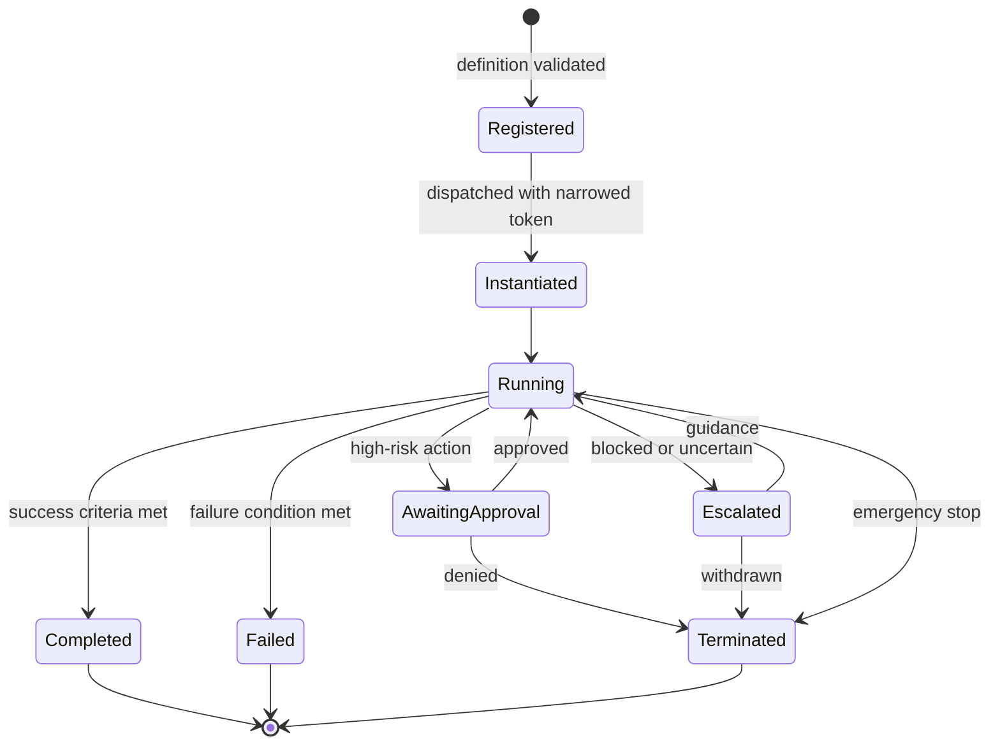

# Agent Architecture

**Status:** **Active** — Section 02, approved by James 2026-08-12.
**Constrained by:** [`../ai/AGENT_PRINCIPLES.md`](../ai/AGENT_PRINCIPLES.md), which governs
when agents may exist. This document defines how they run. Where they disagree, the
principles win.

---

## 1. Agent Categories

Agents are organized by **responsibility**, never by business, department, or UI section.
Six categories, defined by what kind of judgment they exercise:

| Category | Exercises | Typical rights | Example responsibility |
| --- | --- | --- | --- |
| **Strategic** | Judgment across scopes | Read, analyze, recommend | Planning across a business |
| **Domain** | Knowledge of one domain | Read, analyze, prepare | Understanding LIFE or WEALTH |
| **Operational** | Routine execution | Prepare, execute (low risk) | Running a defined workflow |
| **Research** | Gathering and evaluating | Read, external read | Investigating a question |
| **Execution** | Producing change | Prepare, execute (scoped) | Driving a build or deployment |
| **Review** | Verification | Read only, always | Checking work before approval |

**Review agents hold read-only rights, permanently.** An agent that can both produce and
approve its own work provides no verification. This constraint is structural, not policy.

**The list of actual agents is deliberately not fixed here.** Section 1 forbids creating
agents to fill a taxonomy. Sections 06 and 21 define concrete agents when concrete
responsibilities exist. What Section 2 fixes is the *shape* an agent must have.

---

## 2. Agent Definition

Every agent declares the thirteen fields required by
[`../ai/AGENT_PRINCIPLES.md`](../ai/AGENT_PRINCIPLES.md) §2. The runtime **refuses to
instantiate an agent whose definition is incomplete** — the requirement is enforced, not
advisory.

Three fields carry particular weight at runtime:

- **Allowed Context** — the maximum scope an instance may ever hold. No token exceeding it is
  ever issued. ¹
- **Allowed Tools** — a closed list. A tool not named cannot be called, even if it exists
  and the context would permit it.
- **Non-Responsibilities** — what the agent must refuse. Enforced where mechanically
  possible; where not, it is a review criterion.

---

## 3. Lifecycle



**Registration** validates the definition. **Instantiation** creates an ephemeral instance
with its own identity and a token *narrowed* to the dispatched work — never the agent's
full Allowed Context by default.

**Instances are ephemeral and single-context.** An instance is created for one execution in
one scope and destroyed after. It is never reused across contexts. This is what prevents
context bleed between clients: there is no long-lived agent process accumulating exposure
to multiple clients' data.

**Termination** is always available: on completion, failure, denial, escalation withdrawal,
or emergency stop. A running agent can always be stopped.

> ¹ **CORRECTED BY SECTION 06 — PROPOSED, not yet accepted.** *(2026-08-14.)* **As accepted
> 2026-08-12 the bullet read** *"The runtime cannot **issue** a token exceeding it, regardless of
> what the orchestrator requests."* **That wording is wrong as accepted**, not merely loose: `I-87`
> requires every consumer to reject a token *"fabricated by anything other than the Context
> service"*, so a runtime that issues tokens produces tokens every enforcement point is obliged to
> refuse, and no agent could act.
>
> **The Context service is the sole issuer. The runtime requests narrowing** (`I-106`,
> [`AGENT_GOVERNANCE.md`](./AGENT_GOVERNANCE.md) §2). At issuance Context refuses any request
> exceeding the requesting execution's own token, **this agent definition**, James's grants, or the
> delegation constraints — which is where `I-07`'s intersection stops being asserted and starts
> being checked. The bound this bullet states is unchanged; only who enforces it is corrected.
>
> **Child executions cannot outlive their granting execution identity** (`AG-11`, `I-107`): on
> completion, failure, termination, revocation or emergency stop alike, a child fails closed at its
> next enforcement point via `V-2`. **There is no suspended agent state** and Section 06
> deliberately introduces none (`AG-12`).
>
> Authority: [ADR 0029](../decisions/0029-delegated-authority.md) and
> [ADR 0031](../decisions/0031-section-06-amendments-to-accepted-architecture.md), both
> **Proposed**; the accepted text is restored verbatim if either is rejected.

---

## 4. Discovery and Delegation

**Discovery.** Agents are selected by the orchestrator from the registry by matching
required responsibility, scope, and rights. Agents do not discover or invoke each other
directly — that would create an unauditable mesh in which authority cannot be traced.

**Delegation** flows through the runtime and narrows:

```text
Coordinator (scope S, rights R)
   → may dispatch a specialist with scope ⊆ S and rights ⊆ R
   → never with scope or rights exceeding its own
```

**Communication** between agents is mediated: structured results returned upward through
the runtime, never direct agent-to-agent channels. Mediation is what makes every
inter-agent transfer inspectable.

---

## 5. Isolation

Each instance runs with:

- its own identity and Context Token
- memory access limited to its token's partitions
- a closed tool list
- no access to credentials (resolved at the tool boundary, never handed to the agent)
- resource and time limits
- no visibility into sibling instances

**An agent never receives a credential.** It calls a tool; the tool asks the Credential
Broker; the broker checks the token and injects the secret at the boundary. A compromised
or misbehaving agent therefore has nothing to exfiltrate — this is the single most
important isolation property in the architecture.

---

## 6. Monitoring and Evaluation

Every instance emits: instantiation, tokens held, tools called, models used, memory
accessed, escalations, approvals, and outcome against its declared success criteria.

Evaluation (Section 41) needs these to be observable, which is why success criteria and
failure conditions are mandatory fields rather than documentation niceties. An agent whose
success cannot be measured cannot be improved, and cannot be trusted with more authority.

---

## 7. Internal Agents vs External Coding Agents

This distinction is load-bearing and is easy to lose. Two different things share the word
"agent":

| | **NOVA internal agent** | **External coding agent** |
| --- | --- | --- |
| Examples | Research agent, review agent | Claude Code, Codex |
| Trust | Inside the trust boundary | **Outside — untrusted** |
| Governed by | `AGENT_PRINCIPLES.md`, this document | `AGENTS.md`, `EXECUTION_ARCHITECTURE.md` |
| Identity | Agent identity | Coding-agent identity |
| Receives | Context Token | **Work Order — never a Context Token** |
| Runs in | NOVA agent runtime | Isolated ephemeral sandbox |
| Credentials | Never holds any | Narrow, task-scoped, brokered, expiring |
| Reach | Scope-limited NOVA resources | One repository, one branch, one sandbox |
| Output | Results, directly usable | **Proposed changes, requiring review** |

**An external coding agent never inherits NOVA access.** It is treated as a capable but
untrusted contractor: given a precise task, a sealed workspace, the minimum credentials,
and no path back into NOVA. Its output is a proposal that a review agent and then James
evaluate — never a change that lands because the agent believed it was finished.

Full model: [`EXECUTION_ARCHITECTURE.md`](./EXECUTION_ARCHITECTURE.md).
