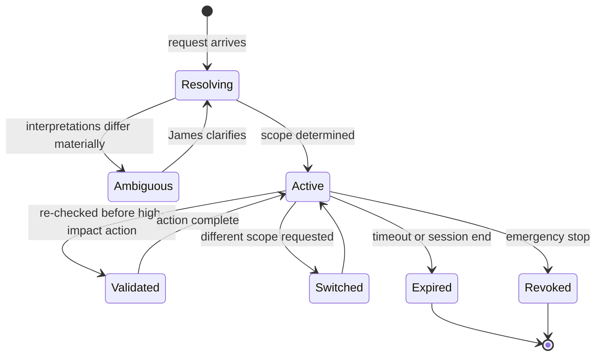

# Context Architecture

**Status:** **Active** — Section 02, approved by James 2026-08-12.
**Implements:** Constitution §6 (Global Intelligence, Local Context) and §7 (Context Lock).

Context answers **where** an operation applies. Policy answers **whether** it is allowed.
Keeping these apart is why the Context service holds no permission logic.

---

## 1. What a Context Is

```text
Context
├── identity        on whose behalf (always ultimately James)
├── scope path      /business/KAIRO/client-a/website/production
├── task            the work this context was opened for
├── origin          how it was established: explicit | inherited | inferred
├── confidence      for inferred contexts
├── opened / expires
└── trace id
```

The scope path is the load-bearing field. Everything downstream — memory partition,
credential resolution, tool authorization, audit attribution — derives from it.

**Context is not session.** One session moves through many contexts. A four-hour
conversation does not accumulate authority; each request resolves its own context.

---

## 2. Lifecycle



**Creation.** Explicit ("in Client A's website"), inherited (child of the active context),
or inferred (from the request, the open work, or recent activity).

**Switching** is always explicit and always visible. NOVA does not silently move between
clients mid-conversation. The surface shows the active context at all times
([`USER_INTERFACE_ARCHITECTURE.md`](./USER_INTERFACE_ARCHITECTURE.md)).

**Inheritance** narrows only. A child context may be a subset of its parent's scope, never
a sibling, never broader.

**Issuance is verified.** ***PROPOSED — added by Section 06, not yet accepted*** *(2026-08-14;
authority [ADR 0029](../decisions/0029-delegated-authority.md) and
[ADR 0031](../decisions/0031-section-06-amendments-to-accepted-architecture.md), both Proposed;
removed if either is rejected).* **The Context service is the sole issuer of Context Tokens**,
including the narrowed tokens dispatched agents carry — already implied by `I-87`, which obliges
every consumer to reject a token "fabricated by anything other than the Context service", and by
[`SYSTEM_LAYERS.md`](./SYSTEM_LAYERS.md) §5 point 1. **The Agent Runtime requests narrowing; it
never mints.**

Before issuing, Context refuses any request whose resulting token would exceed **any** of: the
requesting execution's own integrity-verified token; the named **agent definition's** Allowed
Context, Allowed Tools and Permissions; James-created grants; or the delegation constraints of
`I-107`. **This is the only point at which all four `I-07` inputs exist together**, and it is where
`I-07` stops being asserted and starts being checked (`I-106`,
[`AGENT_GOVERNANCE.md`](./AGENT_GOVERNANCE.md) §2).

**Refusal is total and fail-closed:** on mismatch, on a token failing integrity, on an unreadable
or incomplete agent definition, or on any uncertainty — **no token is issued**, the request is
denied, and the refusal is recorded. **There is no partial issuance.**

**This does not make Context an authorization decider.** §1's separation holds: the check can only
**refuse to issue**, never permit what the PDP denied. **And it does not mitigate compromise of the
Context service** — a compromised Context service issues genuine tokens and would be performing
this check on itself. `T-23a` is unchanged. It does add one dependency: Context must read the agent
registry.

**Expiration.** Contexts are time-bound. An abandoned context does not remain usable
indefinitely — particularly one carrying execute rights.

**Revocation.** The emergency stop invalidates active contexts immediately; in-flight
operations holding them fail closed.

---

## 3. The Context Lock

The Context Lock is the mechanism that makes "Deploy this" safe.

**When James's request is unambiguous within the active context, NOVA acts.** The point of
the Lock is not to interrogate James — that would defeat the product principle. It is to
make the active context *explicit, visible, and validated* so that acting on it is safe.

**Ambiguity test.** NOVA asks only when interpretations differ *materially*: different
scopes, different clients, different environments, or different consequence classes. It
does not ask when the alternatives are equivalent in effect.

```text
"Deploy this."  +  active context = Client A / Website / Staging
   → unambiguous → act

"Deploy this."  +  active context = Client A / Website  (two environments)
   → materially different (staging vs production) → ask

"Deploy this."  +  no active context
   → cannot infer safely → ask
```

**Ambiguity is never resolved by picking the more likely option.** Confidence is not
authorization. An inferred context above the confidence threshold may be *proposed* to
James; it is not silently adopted for anything above `PREPARE`.

---

## 4. Validation Before High-Impact Actions

Before any action classified `EXECUTE` or higher, the context is re-validated:

1. Does the scope path still exist and is it still active?
2. Does the identity still hold rights over it?
3. Has the context expired or been revoked?
4. Does the target resource actually belong to this scope?
5. Does the human-visible context match what is about to happen?

Check 4 is the one that catches the worst class of bug: a correct-looking action against a
resource belonging to a different client. The token says Client A; the resource is Client
B's; the call is denied.

---

## 5. Conflict Handling

| Conflict | Resolution |
| --- | --- |
| Request implies a scope different from the active context | Ask. Never silently switch |
| Two scopes match equally well | Ask, presenting both |
| Requested scope is a sibling of the active one | Deny the implicit path; require explicit switch |
| Referenced resource is outside the active scope | Deny and report. Do not widen context to accommodate |
| Context expired mid-workflow | Pause the workflow, request re-establishment |
| Agent requests scope beyond its grant | Deny, record, escalate |
| Request exceeds the agent definition, the parent token, or a delegation bound | **Refuse issuance entirely.** No partial token; recorded (`I-106`) — *Section 06, Proposed* |

The consistent principle: **when context is uncertain, the system stops rather than
guesses.** Acting in the wrong client context is a security incident
([`../ai/AGENT_PRINCIPLES.md`](../ai/AGENT_PRINCIPLES.md) §6), not a recoverable mistake.

---

## 6. Cross-Scope Requests

A request that legitimately spans scopes ("compare all KAIRO clients' hosting costs") is
**decomposed, not widened**:

```text
Request spanning N scopes
   → N sub-contexts, one per scope, each independently authorized
   → N isolated executions
   → results aggregated above the executions, at Orchestration
   → aggregation recorded as a cross-scope access
```

No single execution ever holds a token spanning sibling scopes. Aggregate intelligence is
produced at the top; access stays isolated at the bottom.

**The aggregation rule (the leak this design would otherwise permit).** Decomposition
protects *access*, but the aggregation point briefly holds results from multiple scopes —
and anything written from there could carry one client's detail into a partition another
can read. Therefore:

1. **Aggregated results are ephemeral.** They are returned to James and discarded.
2. **They are never written to any scope's memory** — not to a participating scope, not to
   their common parent.
3. **Persisting an aggregate requires explicit elevation** ([`MEMORY_AND_KNOWLEDGE_ARCHITECTURE.md`](./MEMORY_AND_KNOWLEDGE_ARCHITECTURE.md) §3),
   is recorded, and must not embed scope-identifying detail from siblings.
4. **Cross-scope aggregation never runs autonomously above `ANALYZE`.** It may inform
   James; it may not drive action across scopes without approval.

Without rule 2 in particular, the isolation model would hold at read time and leak at write
time — a summary is a copy.
