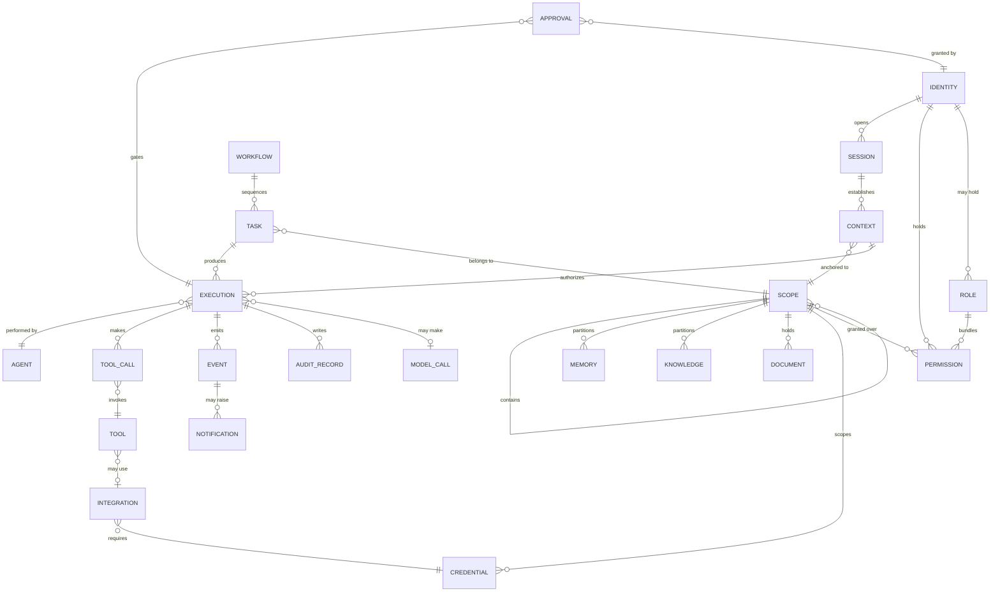

# Data Architecture (Conceptual)

**Status:** **Active** — Section 02, approved by James 2026-08-12.
**Scope:** Conceptual entities and their relationships. **No database, schema, or storage
technology is chosen here** — that is Section 03 (`D-02`, `D-03`).

---

## 1. Entity Map

---

## 2. Entity Definitions

### Identity and access

| Entity | Is | Key relationships |
| --- | --- | --- |
| **Identity** | An actor: human, system, agent, coding agent, service, or client-as-subject | Holds permissions and roles |
| **Role** | A named bundle of permissions | Attaches to identities |
| **Permission** | A right over a resource type, in a scope, at a risk class | Granted to identity or role, over scope |
| **Credential** | An external secret | Scoped to exactly one scope node |
| **Session** | A bounded interaction period | Opens contexts |
| **Context** | The scope path an operation applies to | Anchored to a scope; authorizes executions |

### Structure

| Entity | Is | Key relationships |
| --- | --- | --- |
| **Scope** | A node in the scope tree — the universal boundary | Contains child scopes; partitions memory, knowledge, credentials, permissions |
| **Domain** | A top-level scope: LIFE, BUSINESS, WEALTH | A scope with a fixed role |
| **Business / Client / Project / Environment** | Scope kinds in the BUSINESS subtree | Nested scopes |
| **Area / Thread** | Scope kinds in the LIFE subtree | Nested scopes |

**Business, Client, Project, Environment, Area, and Thread are all *kinds of scope*.** They
differ in what they may contain and what may attach to them — not in their access
mechanics. One rule set governs all of them.

### Work

| Entity | Is | Key relationships |
| --- | --- | --- |
| **Task** | A unit of work | Belongs to a scope; produces executions |
| **Workflow** | A sequence of tasks, decisions, approvals | Sequences tasks |
| **Execution** | One attempt to perform work | Authorized by a context; performed by an agent |
| **Approval** | A human authorization for a specific action | Gates an execution; granted by an identity |

### Capability

| Entity | Is | Key relationships |
| --- | --- | --- |
| **Agent** | A governed AI worker | Performs executions |
| **Tool** | A callable capability | Invoked by tool calls; may use an integration |
| **Integration** | A connection to an external system | Requires a credential |
| **Model Call** | One invocation of a model through the gateway | Belongs to an execution |

### Information

| Entity | Is | Key relationships |
| --- | --- | --- |
| **Memory** | Deliberately retained information | Partitioned by scope |
| **Knowledge** | Curated, sourced, versioned facts | Partitioned by scope |
| **Document** | A file and its contents | Held by a scope |
| **Event** | A record that something happened | Emitted by executions; may raise notifications |
| **Notification** | Something brought to James's attention | Raised from events |
| **Audit Record** | An immutable record of an action and its authorization | Written by executions |

---

## 2.1 Entities Added in Section 03

*These extend the model above; nothing here replaces a Section 02 entity.*

| Entity | Is | Key relationships |
| --- | --- | --- |
| **Classification** | The handling level of an item — PUBLIC … SECURITY-CRITICAL | Attached to every stored item ([`DATA_CLASSIFICATION.md`](./DATA_CLASSIFICATION.md)) |
| **Provenance** | Immutable record of where an item came from | Attached to every significant item |
| **Trust** | Revisable weight of a source | Property of the source, evaluated at use |
| **Lineage** | The set of items an item was derived from | Enables classification inheritance and deletion cascade |
| **Version** | One state of an item over time | Superseded by a later version |
| **Grant** | An explicit right for a subject over a scope | Held by identity or role; revocable, expiring |
| **Denial** | An explicit refusal | Overrides any grant |
| **Credential Binding** | A scoped reference to an external secret — **never the secret** | Belongs to one scope ([ADR 0009](../decisions/0009-credentials-are-references.md)) |
| **Tombstone** | Record that an item was deleted — identity and authorization, never content | Left by deletion |
| **Execution Identity** | The ephemeral identity authorization evaluates | Derived by intersection |

**Credential is no longer modelled as data.** Section 02 listed Credential as "an external
secret." Section 03 refines this: NOVA stores a **Credential Binding**; secret material lives
only in secrets storage. This elaborates rather than reverses ADR 0003 — see
[ADR 0009](../decisions/0009-credentials-are-references.md).

---

## 3. Structural Invariants

These must hold in any implementation. They are the data-level expression of the
security model, and a schema that cannot enforce them is the wrong schema.

**Section 03 extends this list.** The eight below remain in force as `I-S1`–`I-S8`; the
complete set of fifty is in [`INVARIANTS.md`](./INVARIANTS.md), which is the authoritative
specification for isolation testing.

1. **Every scope has exactly one parent** (except root). The tree never becomes a graph —
   a second parent would create a lateral access path.
2. **Every credential belongs to exactly one scope.** There are no global credentials.
3. **Every memory, knowledge item, and document belongs to exactly one scope.**
4. **Every execution references exactly one context**, and that context's scope path
   bounds every resource it may touch.
5. **Every tool call records the context, tool, credential reference, and outcome.**
6. **Audit records are append-only.** Nothing deletes or edits them, including James.
7. **A client identity never holds a permission.** Clients are subjects, not actors.
8. **Cross-scope reads require an explicit grant**, recorded per access.

Invariant 1 is the one most likely to be eroded for convenience — "this project serves two
clients" is the request that breaks isolation. The answer is two projects.

---

## 4. What Remains to Be Decided

Section 03 delivered the **conceptual** data model — entities, relationships, classification,
provenance, lineage, lifecycle, and fifty invariants — but was explicitly instructed not to
select technology.

Still open: storage technology (`D-02`), physical partitioning strategy — row-level vs schema
vs database separation (`D-33`) — indexing, and the encryption model (`D-35`). See
[`../decisions/DEFERRED_DECISIONS.md`](../decisions/DEFERRED_DECISIONS.md).

Whatever is chosen must be able to enforce [`INVARIANTS.md`](./INVARIANTS.md). **A storage
technology that cannot enforce `I-03` structurally is the wrong choice**, regardless of its
other merits.
