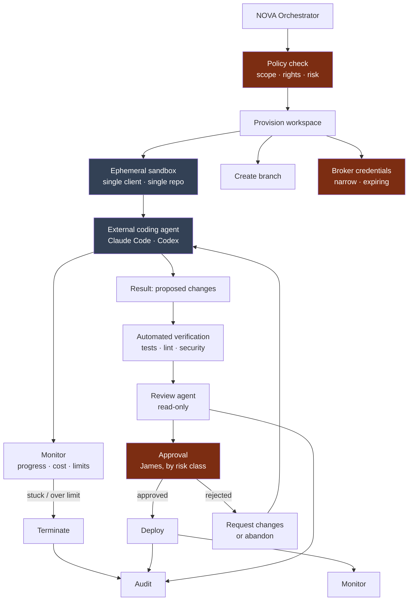
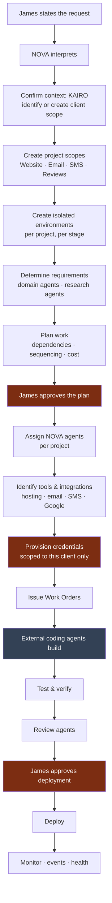

# Execution Architecture

**Status:** **Active** — Section 02, approved by James 2026-08-12.
**Covers:** how NOVA orchestrates **external coding agents** (Claude Code, Codex, future
systems), and the end-to-end KAIRO client scenario.

This is the highest-risk area of the architecture: it is where NOVA hands work to a system
it does not control, touching real client infrastructure.

---

## 1. Governing Stance

> An external coding agent is a **capable but untrusted contractor**. It receives a precise
> task, a sealed workspace, the minimum credentials, no path back into NOVA, and its output
> is a **proposal** — never a change that lands because the agent believed it was finished.

Four consequences, each non-negotiable:

1. **No Context Token ever leaves NOVA.** External agents receive a **Work Order**, a
   different object with no authority inside NOVA.
2. **Sandboxes are ephemeral and single-client.** One sandbox, one client, one repository,
   one branch, one task. Destroyed after.
3. **Credentials are brokered, narrow, and expiring** — never the client's real long-lived
   secrets, never anything usable outside the task.
4. **Output is reviewed before it lands.** Verification, then approval, then deploy.

---

## 2. The Work Order

```text
Work Order
├── task              precise statement of what to build
├── repository        exactly one
├── branch            exactly one, created for this order
├── workspace         ephemeral sandbox id
├── credentials       brokered handles — narrow, expiring, task-scoped
├── constraints       what must not be touched; conventions to follow
├── success criteria  what "done" means, verifiable
├── limits            time, cost, tokens, iterations
└── trace id          links back into NOVA's audit trail
```

**What a Work Order deliberately omits:** the Context Token, NOVA identity, scope paths,
memory access, other clients' existence, and any credential not required by the task.

An external agent cannot read NOVA memory, cannot call NOVA tools, cannot discover other
clients, and cannot widen its own workspace. Not because it is instructed not to —
because it holds nothing that would let it.

### 2.1 NOVA Generates Work Orders

*Added 2026-08-12 per James's clarification to [ADR 0005](../decisions/0005-external-coding-agent-isolation.md).*

**NOVA must eventually produce precise Work Orders from James's high-level requests.** He
says "build Client A a booking page"; NOVA — not the coding agent — resolves that into a
task, repository, branch, constraints, and verifiable success criteria.

```text
James's high-level request
   ↓  Orchestrator — Interpreter and Planner
   ↓  Domain agents — what this kind of work requires
   ↓  Client/project scope — conventions, stack, constraints, history
   ↓  Review criteria — what "done" must mean, verifiably
   → Work Order  (unchanged: no Context Token, no scope paths, no NOVA identity)
```

**This strengthens the boundary rather than relaxing it.** Because a coding agent cannot ask
NOVA for missing context, the pressure to widen its access comes from underspecified tasks.
Moving the specification burden onto NOVA removes that pressure at the source: the better
NOVA specifies, the weaker the case for ever granting broader access.

Everything informing the Work Order stays inside the trust boundary. What crosses is only
the finished, minimal specification — same object, same omissions.

**Constraints:** a generated order carries no more than a hand-written one; success criteria
must be verifiable; issuing it remains subject to its risk class — automating the
specification does not automate the authorization; an underspecified order **fails closed**
and escalates to James rather than dispatching a vague task; and generation quality is
itself evaluated (Section 41).

Owned by Sections 08 and 30.

---

## 3. Execution Flow



**Stages NOVA owns:** authorization, provisioning, monitoring, verification, review,
approval routing, deployment, and audit. The external agent owns exactly one stage —
producing candidate changes inside a sealed box.

---

## 4. The Required Guarantees

| Concern | Guarantee |
| --- | --- |
| **Permissions** | Policy authorizes the work order before provisioning. The agent has no NOVA permissions at all |
| **Sandboxing** | Ephemeral, network-restricted to declared destinations, destroyed after |
| **Credential access** | Brokered, narrow, expiring, task-scoped; never the client's primary secrets; revoked at completion |
| **Client isolation** | One sandbox per client. No sandbox ever holds two clients' material |
| **Repository isolation** | Exactly one repository per work order |
| **Branch isolation** | A dedicated branch. Never direct commits to a protected branch |
| **Auditability** | Every action traced: prompts issued, files changed, commands run, credentials used, cost incurred |
| **Approval** | Merge and deploy require approval by risk class. The agent cannot self-approve |
| **Failure recovery** | Timeouts, cost ceilings, loop detection; terminate and escalate leaving the branch intact for inspection |

**On monitoring a stuck agent.** Long-running autonomous coding is prone to loops. NOVA
enforces wall-clock, cost, and iteration ceilings, plus a no-progress detector. Exceeding
any ceiling terminates the session and escalates — the branch is preserved so the partial
work can be inspected rather than lost.

---

## 5. The KAIRO Execution Model

The scenario: *"NOVA, onboard this new KAIRO client. They need a website, email automation,
SMS follow-up, and a Google review system."*



**What James does:** states the request, approves the plan, approves deployment. Three
touchpoints. Everything between is NOVA's coordination — which is the product principle
made concrete.

**What the architecture guarantees throughout:**

- Every scope created sits under `/business/KAIRO/<client>` — the new client is isolated
  from every existing client from the moment it exists.
- Four projects means four sets of scopes, four credential sets, four sandboxes. The SMS
  work cannot reach the website's hosting credentials.
- Shared *technology* across clients never means shared *environments*
  ([`../DOMAIN_MODEL.md`](../DOMAIN_MODEL.md) §7).
- No external agent ever learns that other KAIRO clients exist.
- Every step is attributable: which agent, which tool, which credential, which model, what
  it cost, what was approved and by whom.

**This is an architectural requirement, not an instruction to implement the workflow.**
Sections 11, 12, 21, and 22 build it.

---

## 6. Why Not Give Coding Agents More Access

The tempting simplification is to let a coding agent hold broader credentials and reach
into NOVA for context it might need. It is rejected because the blast radius is
unacceptable: a single prompt injection in a client's repository, a single confused agent,
or a single upstream compromise would then reach every client NOVA serves.

The cost of the chosen design is real — more provisioning, more brokering, more review,
and occasionally an agent that lacks context it would have found useful. That cost is
accepted. Recorded as [`../decisions/0005-external-coding-agent-isolation.md`](../decisions/0005-external-coding-agent-isolation.md).
