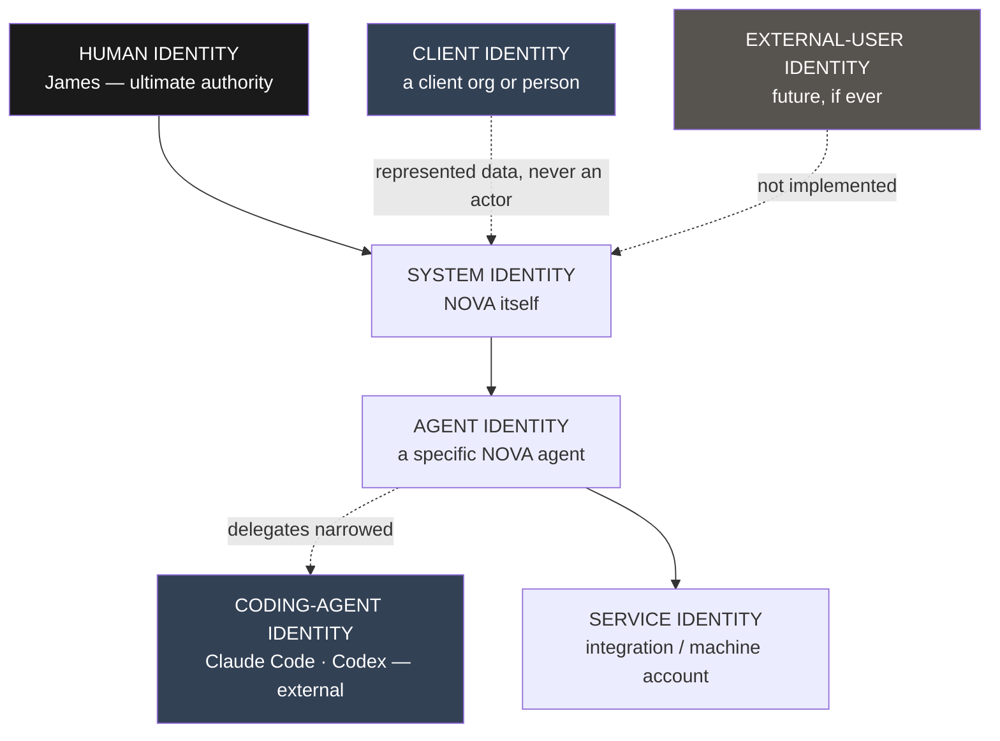

# Identity and Authority

**Status:** **Active** — Section 02, approved by James 2026-08-12.
**Resolves:** **M-3** (identity undefined) and **M-4** (roadmap authority undefined).
**Adds to:** [`../ai/AI_TERMINOLOGY.md`](../ai/AI_TERMINOLOGY.md) — the terms defined here
are canonical and are registered there.

---

# Part I — Identity (M-3)

## 1. The Eight Terms, Kept Apart

Section 1 used "identity" inside the definition of Permission without defining it. These
eight terms are routinely blurred in AI systems, and blurring them is how privilege
escalation becomes invisible.

| Term | Definition | Answers |
| --- | --- | --- |
| **Identity** | A durable claim to be a specific actor | *Who* |
| **Authentication** | Proving an identity is genuine | *Are you really who you claim* |
| **Authorization** | Deciding whether an identity may perform an action | *May you* |
| **Role** | A named bundle of permissions attachable to an identity | *What kind of actor* |
| **Permission** | A rule granting a right over a resource in a scope | *What specifically* |
| **Credential** | A secret allowing access to an **external** system | *How to reach outward* |
| **Session** | A bounded period of interaction with continuity | *When, and for how long* |
| **Context** | The scope path an operation applies to | *Where* |

**The three most damaging confusions, stated explicitly:**

- **Identity ≠ Role.** James has one identity; he may act under several roles.
- **Permission ≠ Credential.** A permission is NOVA's internal rule; a credential is an
  external secret. Holding a permission does not produce a credential, and holding a
  credential does not confer a permission.
- **Session ≠ Context.** One session may move through many contexts. A long conversation
  does not accumulate authority.

---

## 2. Identity Classes

Six classes. Each authenticates differently, and each has a hard ceiling on the authority
it can ever hold.



**Human identity — James.** The only identity that is an *origin* of authority. Every
action in NOVA traces back to it. Authenticates as a person. Ceiling: none.

**System identity — NOVA.** The platform acting on James's behalf for scheduled and
autonomous work. Distinct from James so that "NOVA did this automatically" and "James
asked for this" are never confused in the audit trail. Ceiling: whatever James has
delegated, minus anything requiring explicit human approval.

**Agent identity.** Each NOVA agent instance has its own identity, scoped to one context.
Ceiling: the narrowest of its definition, its grant, and its Context Token. Agent
identities are ephemeral — created per execution, never reused across contexts.

**Coding-agent identity.** Claude Code, Codex, and future execution agents. **Outside
NOVA's trust boundary.** They authenticate as external services, receive a Work Order
rather than a Context Token, and never hold NOVA identity. Ceiling: one repository, one
branch, one sandbox, one task. → [`EXECUTION_ARCHITECTURE.md`](./EXECUTION_ARCHITECTURE.md)

**Service identity.** An integration or machine account (a mailbox, a hosting account, a
GitHub App). Bound to exactly one scope node. Ceiling: the specific external system, in
the specific scope, for the specific operations its credential permits.

**Client identity.** A client organization or person **represented as data inside NOVA**.
This is the critical distinction: a client identity is a *subject that data is about*, not
an *actor that does things*. Clients do not authenticate into NOVA and hold no permissions.

**External-user identity.** Reserved for possible future staff or collaborator access
(`Q-04`, unanswered). Deliberately not implemented. It is named here so that if it arrives,
it arrives as a defined class rather than as an expansion of James's identity — which is
how single-user systems become insecure multi-user systems.

---

## 3. How Authority Narrows

```text
James's authority
  → delegated to NOVA (system identity)
    → narrowed by the Context Lock to one scope path
      → narrowed by agent definition to declared tools and rights
        → narrowed by risk class to what needs no fresh approval
          → narrowed at the tool boundary to one credential, one operation
```

Every arrow narrows. **No mechanism in the architecture widens authority at any step.**
An agent that needs more must escalate upward and be granted it explicitly — which is an
event, recorded and attributable.

---

# Part II — Architectural Governance (M-4)

## 4. Who May Change What

Section 1 established James as ultimate authority but never said who may reorder the
roadmap, alter principles, or change agent permissions. That gap let a future agent cite
"sections are not strictly sequential" to justify jumping ahead. This closes it.

**Five change classes.** Every change to NOVA falls into exactly one.

| Class | Covers | AI may propose | AI may implement | James must approve |
| --- | --- | --- | --- | --- |
| **C0 — Editorial** | Typos, formatting, broken links, clarifications that change no meaning | ✅ | ✅ | ❌ |
| **C1 — Implementation** | Code, tests, docs within approved architecture | ✅ | ✅ | ❌ |
| **C2 — Structural** | New components, schema changes, dependencies, tool definitions, section scope | ✅ | ❌ | ✅ |
| **C3 — Architectural** | Layer boundaries, domain model, permissions, isolation, credentials, approvals, agent authority, technology selection, roadmap ordering | ✅ | ❌ | ✅ **+ ADR** |
| **C4 — Constitutional** | Golden Rules, Constitution, this governance model, identity classes | ✅ | ❌ | ✅ **+ ADR, explicit** |

**Escalation rule:** when the class is unclear, treat it as the higher class and ask. A
change misclassified downward is how architecture erodes; a change misclassified upward
costs one question.

## 5. Specific Authorities

| Subject | Class | Who decides |
| --- | --- | --- |
| Architectural direction | C3 | James, on proposal, recorded as ADR |
| **Roadmap ordering** | **C3** | **James only.** No agent may reorder, skip, merge, or begin a section on its own reading of dependencies |
| Section definitions | C3 | James |
| Foundational principles | C4 | James, explicitly |
| Technology decisions | C3 | James, on proposal with alternatives and lock-in analysis |
| Agent permissions | C3 | James. No agent may alter its own or another's |
| Adding a business/client/project | C1 | Configuration within approved architecture — NOVA may do this on James's instruction |
| **Creating an agent** ¹ | **C3** | Creation necessarily sets Permissions, Allowed Context and Allowed Tools — mandatory fields — so it always sets agent authority |
| **Registering or changing an agent definition** ¹ | **C2** | A new component, the direct analogue of a tool definition |
| …where it sets or changes Permissions, Allowed Context, Allowed Tools, or risk ceiling ¹ | **C3** | Agent permissions are already C3 in the row above |
| **Changing an agent's model / capability profile** ¹ | **C2** | Not an authority — egress is decided per call by Section 05 (`I-94`, `I-97`, `I-98`) |
| **Activating an agent** ¹ | part of the governed registration/creation act | Separating them would create a window in which a definition is approved but its activation is not |
| **Suspending or revoking an agent** ¹ | **C1** | Restriction. Gating removal like granting would make the safety operation slower than the dangerous one |
| **Replacing an agent definition** ¹ | **C3** | A replacement is a new definition carrying authority-bearing fields |
| **Instantiating an agent execution** ¹ | **not governance** | Execution, bounded at token issuance (`I-106`) |

> ¹ ***PROPOSED — added by Section 06, not yet accepted*** *(2026-08-14; authority
> [ADR 0030](../decisions/0030-agent-governance-and-approval-binding.md) and
> [ADR 0031](../decisions/0031-section-06-amendments-to-accepted-architecture.md), both Proposed;
> removed if either is rejected).* **No new change class is created and no existing class is
> reinterpreted.** §4 already classes "New components… tool definitions" as C2 and "agent authority"
> as C3, and the row above already classes *agent permissions* C3 — but **no agent lifecycle
> operation was named anywhere**, so agent *creation*, the operation that fixes an agent's
> authority in the first place, had no class and could be read as C1 configuration. That was the
> shortest available path from model output to a privileged agent. **Registration and activation
> are authorization; instantiation is execution; none of this is configuration.** Full model:
> [`../architecture/AGENT_GOVERNANCE.md`](../architecture/AGENT_GOVERNANCE.md) §5.

**On the roadmap specifically:** `ROADMAP.md` says sections are not strictly sequential and
may be combined. That statement describes *James's* latitude, not an agent's. An agent
reads the roadmap to determine which section owns its work, and stops when the work belongs
elsewhere.

## 6. What NOVA May Do Without Asking

NOVA is meant to be useful, not paralysed. Within approved architecture and an authorized
context, NOVA may **read, analyze, recommend, and prepare** freely — draft the email,
stage the deployment, produce the plan, prepare the migration. What it may not do without
the appropriate approval is **execute** anything of consequence.

The dividing line is the risk classification in
[`PERMISSION_ARCHITECTURE.md`](./PERMISSION_ARCHITECTURE.md) §4, not this document.

## 7. Proposal Path

```text
NOVA or coding agent identifies a need
        ↓
Drafts a proposal — options, tradeoffs, lock-in, consequences
        ↓
C0/C1 → implement and report
C2    → James approves, then implement
C3/C4 → ADR drafted with status Proposed
        ↓
James accepts, rejects, or defers
        ↓
Accepted → status Accepted, architecture documents updated, then implement
```

An AI agent may draft an ADR. It may never mark one `Accepted` — restating Section 1's
rule, which this document operationalizes rather than replaces.
