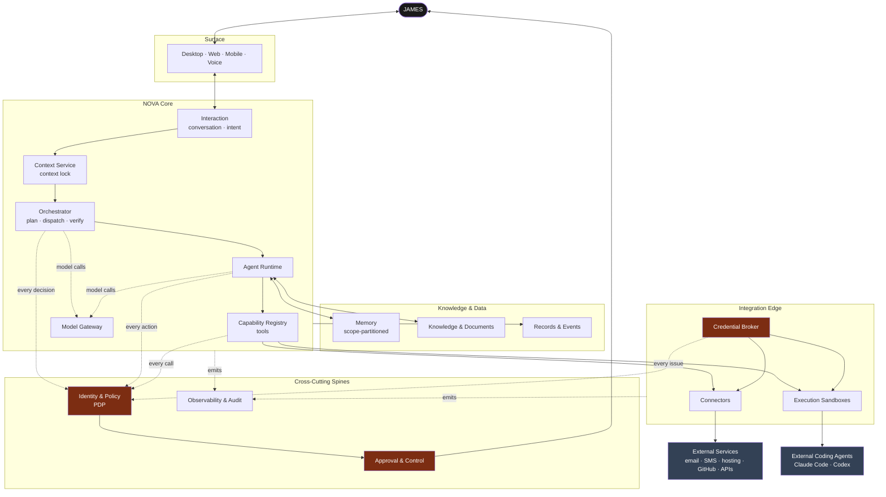
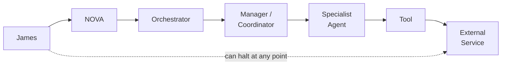
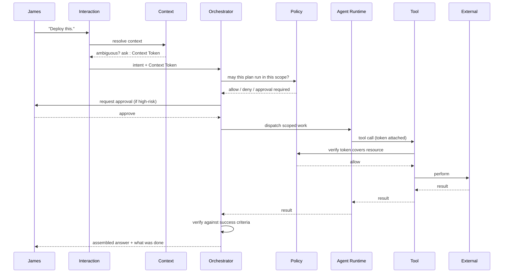

# NOVA Master Architecture

**Status:** **Active** — established in Section 02, approved by James 2026-08-12.
**Authority:** Subordinate to [`../CONSTITUTION.md`](../CONSTITUTION.md). Where this
document and the Constitution disagree, the Constitution wins and the conflict is a defect
to be reported.
**Purpose:** The canonical high-level blueprint of how NOVA works. Every other
architecture document elaborates one part of this one.

> **On status.** James accepted ADRs `0001`–`0008` on 2026-08-12, so this architecture is
> **approved and Active**. Two clarifications were recorded at acceptance: shared resources
> ([ADR 0002](../decisions/0002-unified-scope-tree.md)) and NOVA-generated Work Orders
> ([ADR 0005](../decisions/0005-external-coding-agent-isolation.md)). Neither changed a core
> decision. Changing anything here now requires a superseding ADR — see
> [`IDENTITY_AND_AUTHORITY.md`](./IDENTITY_AND_AUTHORITY.md) Part II.

---

## 1. What This Architecture Must Achieve

**Extremely sophisticated underneath. Extremely simple above.**

James talks to NOVA. NOVA coordinates everything else — agents, models, tools, databases,
workflows, environments, and coding sessions. James never assembles that machinery by
hand, and never needs to know it exists.

Four requirements shape every decision below:

1. **Isolation is structural.** Client A's data must be unreachable from Client B's
   context by construction, not by an agent choosing correctly.
2. **Authority is delegated, never assumed.** Every action traces to James.
3. **Providers are replaceable.** No AI provider, cloud, or vendor may become load-bearing.
4. **The system must stay legible.** A new coding agent, six months from now, must be able
   to read this directory and understand NOVA.

---

## 2. The Two Organizing Ideas

Almost everything in NOVA follows from two structures. Understanding these two is enough
to understand the shape of the whole system.

### 2.1 The Scope Tree

NOVA organizes *everything it knows and does* into one tree of **scopes**. A scope is
simultaneously a context anchor, a permission boundary, a memory partition, and a
credential partition. One concept, four jobs.

```text
NOVA                                    (root scope)
├── LIFE                                (domain scope)
│   ├── Area: School
│   ├── Area: Health
│   └── Area: Travel
├── BUSINESS                            (domain scope)
│   ├── KAIRO                           (business scope)
│   │   ├── Client A                    (client scope)
│   │   │   └── Website Project         (project scope)
│   │   │       ├── Production          (environment scope)
│   │   │       └── Staging             (environment scope)
│   │   └── Client B                    (client scope)
│   └── Business B                      (business scope)
└── WEALTH                              (domain scope)
    └── Account Group                   (wealth scope)
```

**The rule that makes isolation work:** access flows *downward only, and only when
explicitly granted*. Holding a scope never grants access to a sibling, and never grants
access to a parent. Client A and Client B are siblings; there is no path between them.

This single rule replaces a large amount of special-case security logic. LIFE, BUSINESS,
and WEALTH are not three architectures — they are three subtrees under identical rules.

### 2.2 The Context Token

Every operation in NOVA carries a **Context Token**: a scoped, time-bound, verifiable
object naming the scope path the operation is authorized to act within.

```text
Context Token
├── identity        who this action is ultimately on behalf of (James)
├── actor           which agent/service is performing it
├── scope path      /business/KAIRO/client-a/website/production
├── granted rights  read | analyze | prepare | execute | …
├── issued / expires
└── trace id        links every downstream action to this request
```

Tools, memory, credentials, and integrations **refuse any call whose token does not
cover the resource being touched**. Isolation is therefore enforced at the point of
access, not at the point of intention. An agent that "decides" to read Client B's data
produces a denied call and an audit record — not a leak.

---

## 3. System Layers

```text
   ┌──────────────────────────────────────────────────────────────┐
   │  SURFACE            desktop · web · mobile · voice · future  │
   ├──────────────────────────────────────────────────────────────┤
   │  INTERACTION        conversation · intent · presentation     │
   ├──────────────────────────────────────────────────────────────┤
   │  CONTEXT            session · context lock · resolution      │
   ├──────────────────────────────────────────────────────────────┤
   │  ORCHESTRATION      interpret · plan · dispatch · verify     │
   ├──────────────────────────────────────────────────────────────┤
   │  AGENT RUNTIME      agent lifecycle · delegation · limits    │
   ├──────────────────────────────────────────────────────────────┤
   │  CAPABILITY         tools · schemas · risk classes           │
   ├──────────────────────────────────────────────────────────────┤
   │  INTEGRATION        connectors · credential broker           │
   ├──────────────────────────────────────────────────────────────┤
   │  KNOWLEDGE & DATA   memory · knowledge · records · events    │
   ├──────────────────────────────────────────────────────────────┤
   │  PLATFORM           compute · storage · queues · sandboxes   │
   └──────────────────────────────────────────────────────────────┘

   Cross-cutting spines, consulted by every layer:
   IDENTITY & POLICY  ·  APPROVAL & CONTROL  ·  OBSERVABILITY & AUDIT  ·  COST
```

This differs from the layer list proposed in the Section 2 brief in three deliberate ways,
explained in [`SYSTEM_LAYERS.md`](./SYSTEM_LAYERS.md):

- **"User Experience" became "Surface."** UX is a quality of the whole system, not a layer.
  What is actually a layer is the set of devices and channels NOVA is reachable through.
- **Security is not a layer.** It is a spine crossing every layer. A security *layer* would
  imply requests pass through it once; in practice every layer must enforce it.
- **Memory, knowledge, and records share one layer** but are distinct concepts within it —
  conflating them is a known failure mode of AI systems ([`MEMORY_AND_KNOWLEDGE_ARCHITECTURE.md`](./MEMORY_AND_KNOWLEDGE_ARCHITECTURE.md)).

---

## 4. Master System Map



**Read the map this way.** The vertical path down the middle is how work flows. The
red components are where authority is decided — policy, approval, and credentials. The
grey components are outside NOVA's trust boundary and are treated as hostile by default,
including external coding agents.

### Authority flow



Authority only ever narrows as it flows right. No component may grant itself, or a
component to its right, more authority than it holds.

---

## 5. NOVA Core

NOVA Core is **not one application**. It is a set of services with narrow, stable
interfaces, each independently replaceable:

| Service | Owns | Explicitly does not own |
| --- | --- | --- |
| **Identity** | Who is acting, what class of identity they are | What they may do |
| **Context** | Active context, the Context Lock, scope resolution | Deciding whether access is allowed |
| **Policy (PDP)** | The decision "is this allowed, in this scope, at this risk" | Executing anything |
| **Orchestration** | Interpreting, planning, dispatching, verifying | Domain logic; credentials |
| **Agent Runtime** | Agent lifecycle, isolation, resource limits | Choosing what work to do |
| **Capability Registry** | Tool definitions, schemas, risk classes | Business meaning of a tool |
| **Model Gateway** | Provider-neutral model access and routing | Prompt content |
| **Memory** | Scope-partitioned retention | Truth about the outside world |
| **Event Bus** | Distribution of things that happened | Interpreting them |
| **Approval** | Human-in-the-loop gating | Deciding risk (Policy does) |
| **Observability** | Logs, traces, audit records | Enforcement |

**Why this decomposition.** The failure mode being avoided is a Core that becomes a
monolith where "everything talks to everything." Each service above answers exactly one
question. The Policy service in particular exists so that authorization is decided in *one*
place and enforced in *many* — the alternative, permission checks scattered through
orchestration and tool code, is how isolation quietly rots.

---

## 6. Cross-Cutting Spines

**Identity & Policy.** A single Policy Decision Point answers every "may this happen?"
question. Every layer holds a Policy Enforcement Point that asks before acting.
→ [`PERMISSION_ARCHITECTURE.md`](./PERMISSION_ARCHITECTURE.md),
[`IDENTITY_AND_AUTHORITY.md`](./IDENTITY_AND_AUTHORITY.md)

**Approval & Control.** Actions carry a risk class; risk class plus scope determines
whether James is asked. Includes the emergency stop required by Constitution §11.
→ [`PERMISSION_ARCHITECTURE.md`](./PERMISSION_ARCHITECTURE.md) §4–6

**Observability & Audit.** Every action emits a record linked by trace id, including what
NOVA believed at the time. → [`EVENT_AND_OBSERVABILITY_ARCHITECTURE.md`](./EVENT_AND_OBSERVABILITY_ARCHITECTURE.md)

**Cost.** Model and service selection is cost-aware.
→ [`SCALE_AND_COST_ARCHITECTURE.md`](./SCALE_AND_COST_ARCHITECTURE.md)

---

## 7. Request Lifecycle



The two checkpoints that matter: **context is resolved before planning**, and **policy is
consulted both before planning and again at the point of access.** Checking once is how
systems leak.

---

## 8. Document Map

| Document | Answers |
| --- | --- |
| [`SYSTEM_LAYERS.md`](./SYSTEM_LAYERS.md) | What each layer owns and may call |
| [`DOMAIN_ARCHITECTURE.md`](./DOMAIN_ARCHITECTURE.md) | LIFE, BUSINESS, WEALTH; the scope tree (**M-1, M-2**) |
| [`IDENTITY_AND_AUTHORITY.md`](./IDENTITY_AND_AUTHORITY.md) | Identity classes; governance (**M-3, M-4**) |
| [`CONTEXT_ARCHITECTURE.md`](./CONTEXT_ARCHITECTURE.md) | Context lifecycle, locking, validation |
| [`MEMORY_AND_KNOWLEDGE_ARCHITECTURE.md`](./MEMORY_AND_KNOWLEDGE_ARCHITECTURE.md) | Memory tiers vs knowledge vs records |
| [`AGENT_ARCHITECTURE.md`](./AGENT_ARCHITECTURE.md) | Internal agents; categories; lifecycle |
| [`ORCHESTRATION_ARCHITECTURE.md`](./ORCHESTRATION_ARCHITECTURE.md) | Orchestrator; workflows |
| [`EXECUTION_ARCHITECTURE.md`](./EXECUTION_ARCHITECTURE.md) | External coding agents; the KAIRO model |
| [`DATA_ARCHITECTURE.md`](./DATA_ARCHITECTURE.md) | Conceptual entities and relationships |
| [`PERMISSION_ARCHITECTURE.md`](./PERMISSION_ARCHITECTURE.md) | Permissions, risk classes, approvals |
| [`SECURITY_BOUNDARIES.md`](./SECURITY_BOUNDARIES.md) | Every boundary and what may cross it |
| [`TOOL_AND_INTEGRATION_ARCHITECTURE.md`](./TOOL_AND_INTEGRATION_ARCHITECTURE.md) | Tools, integrations, credentials |
| [`MODEL_ARCHITECTURE.md`](./MODEL_ARCHITECTURE.md) | Model gateway and routing |
| [`EVENT_AND_OBSERVABILITY_ARCHITECTURE.md`](./EVENT_AND_OBSERVABILITY_ARCHITECTURE.md) | Events, logs, traces, audit |
| [`RELIABILITY_ARCHITECTURE.md`](./RELIABILITY_ARCHITECTURE.md) | Failure, retry, rollback, recovery |
| [`USER_INTERFACE_ARCHITECTURE.md`](./USER_INTERFACE_ARCHITECTURE.md) | Information architecture; devices |
| [`SCALE_AND_COST_ARCHITECTURE.md`](./SCALE_AND_COST_ARCHITECTURE.md) | Growth and cost awareness |
| [`TESTING_ARCHITECTURE.md`](./TESTING_ARCHITECTURE.md) | How this is verified |
| [`../decisions/`](../decisions/README.md) | Why each major choice was made |

---

## 9. What This Architecture Deliberately Does Not Decide

No database, cloud, framework, language, model provider, queue, or vector store is chosen
here. Section 2 defines *what must exist and how the parts relate*; Sections 03 onward
choose *what to build it with*. Every open item is listed in
[`../decisions/DEFERRED_DECISIONS.md`](../decisions/DEFERRED_DECISIONS.md) with the
section that owns it.
