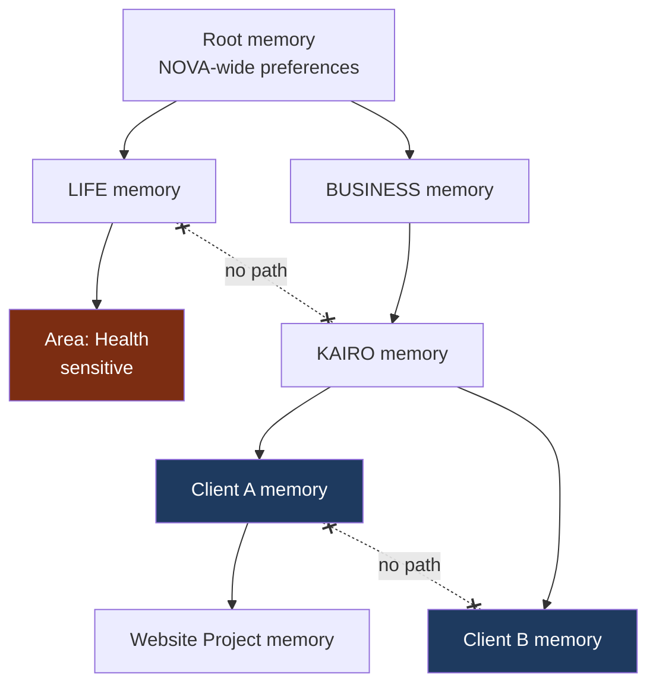

# Memory and Knowledge Architecture

**Status:** **Active** — Section 02, approved by James 2026-08-12.
**Owns:** the distinction between the six kinds of information NOVA holds, and the rules
that keep them from contaminating each other. Storage technology is deferred (`D-02`,
`D-06`, `D-24`).

---

## 1. Six Kinds of Information, Not One

Treating everything an AI system knows as "context" is a primary cause of both hallucination
and data leakage. NOVA distinguishes six:

| Kind | Definition | Authority | Lifetime |
| --- | --- | --- | --- |
| **Memory** | What NOVA deliberately retained about James's world | NOVA's own record | Long, curated |
| **Knowledge** | Curated, structured facts NOVA can rely on | Verified source | Long, versioned |
| **Documents** | Files and their contents | The file itself | As long as kept |
| **External research** | Information gathered from outside | Cited source, may be wrong | Point-in-time |
| **Live data** | Current state of an external system | The external system now | Seconds to hours |
| **System state** | NOVA's own operational condition | NOVA itself | Now |

**Why this matters concretely.** "The client's site is down" is *live data* — checking it
again may contradict it. "The client prefers Tuesday deployments" is *memory*. "Their DNS
provider is X" is *knowledge*. An architecture that stores all three the same way will
eventually assert a six-month-old outage as current fact. Each kind carries its type,
source, and timestamp, and the epistemic labels of Constitution §14 attach to it.

---

## 2. Memory Tiers

```text
CONVERSATION   this exchange                            minutes      not persisted by default
SESSION        this working period                      hours        expires with session
WORKING        this task or workflow                    task-scoped  discarded on completion
SCOPE          durable memory of one scope node         long         curated, partitioned
INSTITUTIONAL  how NOVA itself operates                 permanent    system-level
```

The first three are transient by design. Only **scope memory** and **institutional memory**
persist, and only scope memory contains information about James's world.

---

## 3. Memory Is Partitioned by Scope

Memory attaches to a node in the scope tree and obeys the same access rule as everything
else: **downward only, explicit grants only.**

```text
James Personal Memory   ≠   KAIRO Memory   ≠   Client A Memory   ≠   Client B Memory
```



**Writing.** A memory written while working in Client A's context is written to Client A's
partition. It cannot be written to a sibling, and it cannot be written upward — an agent
cannot promote a client detail into business-wide memory without an explicit, audited
elevation.

**Reading.** An agent holding a Context Token for Client A reads root, BUSINESS, KAIRO, and
Client A memory. Client B's partition is not merely filtered from results — it is not
queryable.

**The upward-write rule is the subtle one.** Most leaks are not sideways reads; they are
summaries. An agent that summarizes Client A's work into KAIRO-level memory has moved
client-confidential detail into a partition every other client's work can read. Elevation
is therefore an explicit operation with its own permission and audit record — never a side
effect of summarization.

---

## 4. Personal Memory Never Flows Into Business

LIFE memory and BUSINESS memory are siblings. There is no path between them.

Sensitive LIFE Areas (health, relationships) carry an additional restriction: they are
excluded from any cross-scope aggregation, never summarized into a parent, and readable
only within their own Area context. This is the mechanism preventing NOVA from surfacing
personal information while working on client-facing material.

WEALTH's one-directional read grant ([`DOMAIN_ARCHITECTURE.md`](./DOMAIN_ARCHITECTURE.md) §4)
is the single deliberate exception in the architecture, and it excludes sensitive LIFE
Areas.

---

## 5. Memory Hygiene

Memory that is never curated becomes both a liability and a source of stale assertions.

- **Provenance.** Every memory records when, in what context, and from what it was formed.
- **Correction.** Memory is correctable; corrections supersede rather than delete, so the
  history of what NOVA believed remains auditable.
- **Decay.** Low-value memory ages out. High-value memory is retained until removed.
- **Deletion.** James can delete any memory. Deletion is real, not hidden with a flag —
  Constitution §13 requires it.
- **Review.** Memory is inspectable by James in plain language. Memory James cannot see is
  memory he cannot correct.

---

## 6. Knowledge

Knowledge is curated and structured — the things NOVA may rely on without re-verifying:
how a client's stack is configured, what KAIRO's service offerings are, what James's
standing preferences are.

Knowledge is **versioned and sourced**. Every knowledge item cites where it came from and
when it was last confirmed. An item past its confirmation horizon is downgraded from
verified fact to assumption and labelled as such when used.

Knowledge is scope-partitioned exactly as memory is.

---

## 7. Retrieval Discipline

When assembling context for a model call, the retrieval path must:

1. accept a Context Token and restrict every query to its scope partitions,
2. label each retrieved item with its kind, source, and age,
3. prefer live data over memory for anything volatile,
4. never silently merge kinds into undifferentiated "context",
5. record what was retrieved, so that a later audit can reconstruct what NOVA believed.

Point 5 is what makes the observability requirement "what did NOVA believe at the time?"
answerable ([`EVENT_AND_OBSERVABILITY_ARCHITECTURE.md`](./EVENT_AND_OBSERVABILITY_ARCHITECTURE.md)).
