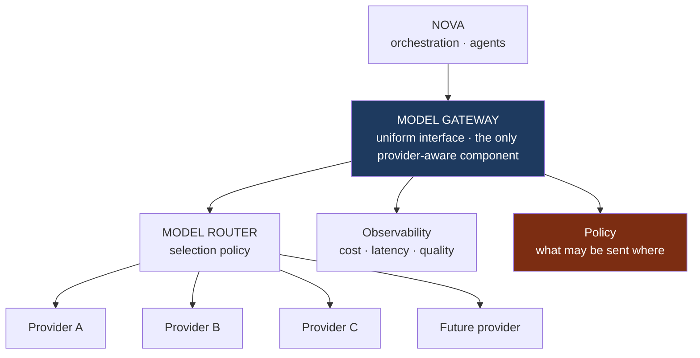

# Model Architecture

**Status:** Proposed — Section 02.
**Implements:** Constitution §10 (AI Provider Independence) and §15 (Cost Awareness).
**Defers:** which providers and models (`D-08`), routing policy specifics (`D-20`).

---

## 1. Provider Independence Is Structural

Constitution §16: *"The repository belongs to James; AI providers are replaceable tools."*
Making that true requires that provider-specific assumptions exist in exactly one place.

**Nothing above the gateway names a provider or model.** An agent requests a *capability
profile* — "long-context reasoning with tool use" — not a model id. This is what makes
provider replacement a configuration change rather than a rewrite.

The test to apply at every future review: *could we remove a provider entirely and keep
working?* If the answer requires touching agents, orchestration, or tools, the abstraction
has leaked.

---

## 2. Gateway Responsibilities

| Owns | Does not own |
| --- | --- |
| Uniform request/response interface | Prompt content |
| Provider adaptation and capability mapping | What to ask |
| Routing (via the router) | Whether the request is permitted — Policy decides |
| Retries, fallback, timeouts | Interpreting results |
| Cost and latency accounting | Business meaning |
| Redaction before egress | Storage of results |

**Redaction before egress is a gateway responsibility.** Before any content leaves for a
provider, the gateway strips credentials and enforces policy on what may be sent where —
including, where required, that certain scopes' data must not reach certain providers at
all. Constitution §13 (data ownership) and Section 37 (privacy) depend on this being one
chokepoint rather than a rule agents are asked to remember.

---

## 3. Selection

The router selects on:

| Factor | Consideration |
| --- | --- |
| **Task** | Reasoning, extraction, generation, classification, coding, verification |
| **Quality bar** | How much correctness matters here |
| **Latency** | Interactive vs background |
| **Cost** | Cheapest model that meets the bar |
| **Context needs** | Volume of input |
| **Tool capability** | Whether reliable tool use is required |
| **Reliability** | Observed provider health |
| **Data policy** | Whether this scope's data may go to this provider |

**The default is the cheapest adequate model, not the most capable one** (Constitution §15).
Escalation to a stronger model is deliberate — triggered by verification failure, declared
task difficulty, or high risk class — not habitual.

**Verification uses an independent path.** Where a result is checked by a model, the
checker should not be the same instance that produced it, and preferably not the same
provider. Self-verification by the same model in the same call is weak evidence.

---

## 4. Failure and Fallback

| Failure | Response |
| --- | --- |
| Provider unavailable | Fail over to an equivalent-profile provider |
| Rate limited | Backoff; reroute if the work is time-sensitive |
| Timeout | Retry once, then reroute |
| Malformed output | Re-request with tightened constraints; then escalate |
| Content refusal | Report honestly; never silently substitute a different answer |
| All providers unavailable | Fail closed, report clearly. Never fabricate a result |

**Fallback never silently lowers quality on high-risk work.** Rerouting a
`HIGH-IMPACT EXECUTE` decision to a weaker model to keep things moving is a failure
disguised as resilience. The correct behaviour is to pause and say so.

---

## 5. Accounting

Every model call records: profile requested, provider and model used, tokens in/out,
latency, cost, outcome, and the execution and trace it belongs to.

This is what makes cost attribution per client, per project, and per workflow possible
([`SCALE_AND_COST_ARCHITECTURE.md`](./SCALE_AND_COST_ARCHITECTURE.md)), and what allows a
provider's real-world quality and reliability to be measured rather than assumed.

---

## 6. What Is Not Decided

No provider, no model, no routing thresholds, no self-hosting question. Recorded as `D-08`
and `D-20`. Section 05 owns them. What Section 2 fixes is that **the decision, whenever it
is made, is reversible.**
