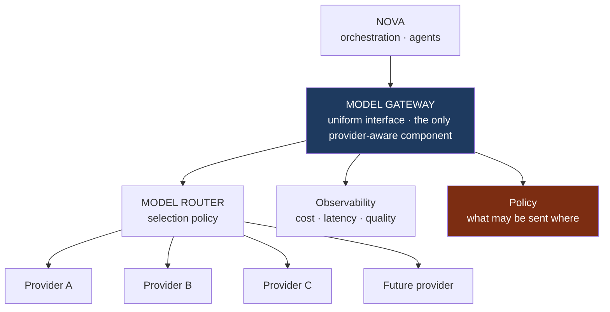

# Model Architecture

**Status:** **Active** — Section 02, approved by James 2026-08-12.
**Implements:** Constitution §10 (AI Provider Independence) and §15 (Cost Awareness).
**Defers:** which providers and models (`D-08`), routing policy specifics (`D-20`).

---

## 1. Provider Independence Is Structural

Constitution §16: *"The repository belongs to James; AI providers are replaceable tools."*
Making that true requires that provider-specific assumptions exist in exactly one place.

**Nothing above the gateway names a provider or model.** An agent requests a *capability
profile* — "long-context reasoning with tool use" — not a model id. This is what makes
provider replacement a configuration change rather than a rewrite.

The test to apply at every future review: *could we remove a provider entirely and keep
working?* If the answer requires touching agents, orchestration, or tools, the abstraction
has leaked.

---

## 2. Gateway Responsibilities

| Owns | Does not own |
| --- | --- |
| Uniform request/response interface | Prompt content |
| Provider adaptation and capability mapping | What to ask |
| Routing (via the router), **within the permitted provider set** ¹ | Whether the request is permitted — Policy decides; the gateway **enforces** that decision ¹ |
| Retries, fallback, timeouts | Interpreting results |
| Cost and latency accounting | Business meaning |
| Redaction before egress | Storage of results |

**Redaction before egress is a gateway responsibility.** Before any content leaves for a
provider, the gateway strips credentials and enforces policy on what may be sent where —
including, where required, that certain scopes' data must not reach certain providers at
all. Constitution §13 (data ownership) and Section 37 (privacy) depend on this being one
chokepoint rather than a rule agents are asked to remember.

> ¹ **AMENDED BY SECTION 05 — PROPOSED, not yet accepted.** *(2026-08-14.)* **As accepted
> 2026-08-12 the two cells read** *"Routing (via the router)"* and *"Whether the request is
> permitted — Policy decides."* Policy was named as the decider and **no enforcement point was
> named**, so redaction and data policy were duties a component judged for itself. Section 05
> makes model egress the **sixth Policy Enforcement Point**: a PDP decision per call, and the
> gateway can only deny (`I-94`, `I-77`). Authority:
> [ADR 0024](../decisions/0024-model-gateway-is-an-enforcement-point.md) and
> [ADR 0028](../decisions/0028-section-05-amendments-to-accepted-architecture.md), both
> **Proposed**; the accepted text is restored verbatim if they are rejected. Full model:
> [`MODEL_GATEWAY_ARCHITECTURE.md`](./MODEL_GATEWAY_ARCHITECTURE.md).

---

## 3. Selection

The router selects on:

| Factor | Consideration |
| --- | --- |
| **Task** | Reasoning, extraction, generation, classification, coding, verification |
| **Quality bar** | How much correctness matters here |
| **Latency** | Interactive vs background |
| **Cost** | Cheapest model that meets the bar |
| **Context needs** | Volume of input |
| **Tool capability** | Whether reliable tool use is required |
| **Reliability** | Observed provider health |
| **Data policy** ² | Whether this scope's data may go to this provider — **a constraint on the candidate set, not a factor weighed against the seven above** |

**The default is the cheapest adequate model, not the most capable one** (Constitution §15).
Escalation to a stronger model is deliberate — triggered by verification failure, declared
task difficulty, or high risk class — not habitual.

**Verification uses an independent path.** Where a result is checked by a model, the
checker should not be the same instance that produced it, and preferably not the same
provider. Self-verification by the same model in the same call is weak evidence.

> ² **AMENDED BY SECTION 05 — PROPOSED, not yet accepted.** *(2026-08-14.)* Two changes, neither
> removing accepted text.
>
> **Data policy** was accepted as one row among eight. Read as a weighted factor it can be traded
> against cost or latency, which is not what it means: it **filters the candidate providers**, and
> the other seven optimise inside that set. An empty permitted set fails closed
> (`I-97`, [`MODEL_GATEWAY_ARCHITECTURE.md`](./MODEL_GATEWAY_ARCHITECTURE.md) §4.1).
>
> **The verification paragraph above states a security property in advisory language** —
> *"should"*, *"preferably"* — and stood behind no invariant. Section 05 fixes what it may
> establish rather than only how it should be arranged: a model check **never** promotes epistemic
> status, **never** satisfies an approval requirement, and **never** lowers a risk class. Above
> `PREPARE`, a different instance is **required**; a different provider stays **preferred and not
> required**, because requiring it would make verification unavailable wherever one permitted
> provider exists — and a silently skipped check is worse than a same-provider one (`I-102`,
> [ADR 0026](../decisions/0026-model-verification-is-corroboration.md),
> [`MODEL_TRUST_AND_AUTHORITY.md`](./MODEL_TRUST_AND_AUTHORITY.md) §5).
>
> Authority: ADRs [0024](../decisions/0024-model-gateway-is-an-enforcement-point.md),
> [0026](../decisions/0026-model-verification-is-corroboration.md) and
> [0028](../decisions/0028-section-05-amendments-to-accepted-architecture.md), all **Proposed**.

---

## 4. Failure and Fallback ³

| Failure | Response |
| --- | --- |
| Provider unavailable | Fail over to an equivalent-profile provider |
| Rate limited | Backoff; reroute if the work is time-sensitive |
| Timeout | Retry once, then reroute |
| Malformed output | Re-request with tightened constraints; then escalate |
| Content refusal | Report honestly; never silently substitute a different answer |
| All providers unavailable | Fail closed, report clearly. Never fabricate a result |

**Fallback never silently lowers quality on high-risk work.** Rerouting a
`HIGH-IMPACT EXECUTE` decision to a weaker model to keep things moving is a failure
disguised as resilience. The correct behaviour is to pause and say so.

> ³ **AMENDED BY SECTION 05 — PROPOSED, not yet accepted.** *(2026-08-14.)* **Every row above that
> reroutes, fails over, or retries is bounded by the permitted provider set** (`I-97`). As accepted
> the table says *"fail over to an equivalent-profile provider"* with no data-policy qualification
> — read literally it permits a degraded system to reach a provider a scope was never permitted to
> reach, which is the moment such a reach is most likely. "All providers unavailable → fail closed"
> is read as **all *permitted* providers unavailable**.
>
> **Each attempt is separately authorized and separately accounted.** A reroute changes the
> destination provider, which is an input to the egress decision, so failover does not inherit the
> first call's allow (`I-104`,
> [`MODEL_GATEWAY_ARCHITECTURE.md`](./MODEL_GATEWAY_ARCHITECTURE.md) §6). Authority:
> ADRs [0024](../decisions/0024-model-gateway-is-an-enforcement-point.md) and
> [0028](../decisions/0028-section-05-amendments-to-accepted-architecture.md), both **Proposed**.

---

## 5. Accounting

Every model call records: profile requested, provider and model used, tokens in/out,
latency, cost, outcome, and the execution and trace it belongs to.

This is what makes cost attribution per client, per project, and per workflow possible
([`SCALE_AND_COST_ARCHITECTURE.md`](./SCALE_AND_COST_ARCHITECTURE.md)), and what allows a
provider's real-world quality and reliability to be measured rather than assumed.

---

## 6. What Is Not Decided

No provider, no model, no routing thresholds, no self-hosting question. Recorded as `D-08`
and `D-20`. Section 05 owns them. What Section 2 fixes is that **the decision, whenever it
is made, is reversible.**

**Section 05 did not select a provider either.** *(Added 2026-08-14 — Proposed.)* It fixed the
criteria a provider must satisfy (`PR-1`–`PR-9`) and left `D-08` open, because the constraints
that decide it are `Q-06` (residency, budget, privacy) and `Q-03` (surfaces) — James's to answer.
`D-20` is partially resolved: routing **constraints** are fixed, thresholds are not. See
[`MODEL_GATEWAY_ARCHITECTURE.md`](./MODEL_GATEWAY_ARCHITECTURE.md) §8 and
[`MODEL_TRUST_AND_AUTHORITY.md`](./MODEL_TRUST_AND_AUTHORITY.md).
