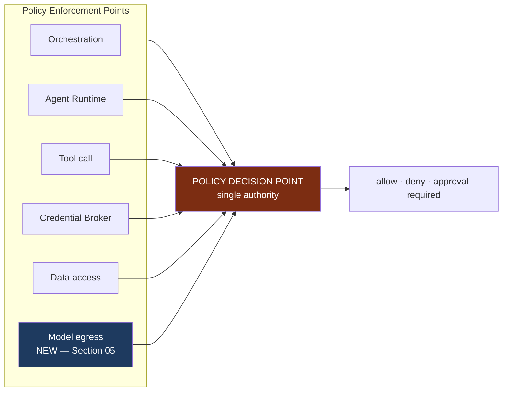

# Model Gateway Architecture

**Status:** **Active** — Section 05, accepted by James 2026-08-14 (ADRs `0024`, `0027`, `0028`).
**Covers:** the Model Gateway as an enforcement point, model egress authorization, redaction,
routing and fallback under data policy, provider credentials, retry semantics, and model cost
control.
**Extends:** [`MODEL_ARCHITECTURE.md`](./MODEL_ARCHITECTURE.md) (Section 02, Active) and
[ADR 0007](../decisions/0007-model-gateway-provider-neutrality.md). Neither is replaced. Section
02 fixed *that* a gateway exists and *that* nothing above it names a provider. This document
fixes *what authority the gateway has and does not have*.

**No provider, model, protocol, algorithm, or vendor is selected.** `D-08` remains deferred and
is explicitly **not** resolved here — see §8.

**Companion document:** [`MODEL_TRUST_AND_AUTHORITY.md`](./MODEL_TRUST_AND_AUTHORITY.md) covers
what model *output* is permitted to do. This document covers what may be *sent*, *where*, and
*under whose authority*.

---

## 1. The Gap This Document Closes

**The gap is a contradiction between accepted documents, not a simple absence.** Stating it
precisely, because the imprecise version overclaims:

[`MODEL_ARCHITECTURE.md`](./MODEL_ARCHITECTURE.md) §1's diagram **does** draw an arrow from the
gateway to `Policy — what may be sent where`, and §2 says the gateway does not own *"whether the
request is permitted — Policy decides."* So Section 02 did intend Policy to govern model egress.

**Four other accepted documents omit it.**
[`PERMISSION_ARCHITECTURE.md`](./PERMISSION_ARCHITECTURE.md) §2 names five enforcement points —
Orchestration, Agent Runtime, Tool call, Credential Broker, Data access — and model egress is none
of them. [`SYSTEM_LAYERS.md`](./SYSTEM_LAYERS.md) §5 lists the five places *"where enforcement is
mandatory"* so a future implementer knows; model egress is absent.
[`MASTER_ARCHITECTURE.md`](./MASTER_ARCHITECTURE.md) §4 draws `every decision`, `every action`,
`every call` and `every issue` into Policy, and the two `model calls` arrows carry no such arrow.
[`SECURITY_BOUNDARIES.md`](./SECURITY_BOUNDARIES.md) §2 claims to enumerate **every** boundary and
what authorization each crossing requires; model egress has no row.

The consequence, stated plainly:

> **A model call was a Policy concern in the document about models and an enforcement point in no
> document about enforcement.** An implementer reading the canonical enforcement lists — which is
> what those lists exist for — would have built egress with no decision on it.

Three concrete things followed. **Emergency stop did not reach model egress** and **revocation did
not take effect there**, because `I-19` and `I-74` are both defined as taking effect *at
enforcement points*. And **failover carried no data-policy constraint at all**
([`MODEL_ARCHITECTURE.md`](./MODEL_ARCHITECTURE.md) §4), so a degraded system could reach a
provider a scope was never permitted to reach.

**Section 05 closes this by making the Model Gateway the sixth Policy Enforcement Point**
([ADR 0024](../decisions/0024-model-gateway-is-an-enforcement-point.md)).

---

## 2. The Gateway as the Sixth Enforcement Point



**`MG-1` — Every model call is an authorization decision (`I-94`).** The gateway presents the
Context Token, the classification of every item in the request, the capability profile, and the
**candidate destination provider**, and receives allow / deny / approval-required. There is no
path that reaches a provider without a decision. If the PDP is unavailable the answer is deny
(`I-17`), and the call does not happen.

**`MG-2` — The decision is per call, not per session, plan, or agent.** This mirrors the Data
Access PEP, which evaluates per access rather than per request
([`ISOLATION_ENFORCEMENT.md`](./ISOLATION_ENFORCEMENT.md)). A plan authorized as a unit
(`ORCHESTRATION_ARCHITECTURE.md` §2) authorizes the *plan*; it does not pre-authorize each
subsequent model call, whose content is not known at plan time.

**`MG-3` — Revocation and emergency stop take effect here.** A revoked token fails closed at the
gateway at the next call (`I-74`); an emergency stop halts egress (`I-19`), and a gateway that
cannot confirm the stop refuses to call
([`PERMISSION_ARCHITECTURE.md`](./PERMISSION_ARCHITECTURE.md) §6, point 3). Without `MG-1` a
long-running agent could continue reasoning — and continue spending — through a stop.

**`MG-4` — The gateway decides nothing about authorization.** It is an *enforcement* point. It
does not evaluate grants, does not classify risk, and does not resolve scope. `I-77`'s
distinction applies unchanged: enforcement can only deny, never permit.

### What this does not claim

**It does not make model egress safe.** It makes it *decided and recorded*. A compromised
gateway is a new named threat (`T-29`), and a compromised PDP still returns `ALLOW` here exactly
as it does at the other five points (`T-19`, `I-85`).

---

## 3. What May Be Sent

### 3.1 One scope per request

**`MG-5` — No model request carries content from more than one scope (`I-95`).**

This is the model-path analogue of `I-86` (no channel bound to more than one scope). Section 03
governs cross-scope *storage* and cross-scope *output*
([`CROSS_SCOPE_DATA_RULES.md`](./CROSS_SCOPE_DATA_RULES.md)); **it says nothing about the model
prompt**, which is a join point of exactly the same kind: two clients' content placed in one
buffer, sent to one third party, under one request.

Cross-scope work reaching a model follows the pattern Section 03 already established: **N
single-scope calls, aggregated above them**, never one call holding both.

**What "more than one scope" means.** The test is the one `I-86` already uses for channels: the
request carries content **not covered by the execution's single bound scope**. PUBLIC and INTERNAL
material is not a second scope. An ancestor-scope shared resource is not automatically permitted
either — it requires the explicit per-resource grant `I-82` already demands, and with that grant it
is content the bound scope covers. What is forbidden is **sibling content in one request**, for
which no token and no grant exists (`SECURITY_BOUNDARIES.md` §3: the client boundary has no
authorized crossing).

**Scopeless model calls go to the control plane.** A model call that concerns no client scope —
NOVA reasoning about its own operation — is decided the same way, and its `I-18` record follows
Section 04's rule unchanged: a decision concerning no client scope is a control-plane event under
writer authority `W-3` (`I-92`), **never forced into a client partition** to satisfy a placement
rule. This is stated because Section 04's `HIGH-1` was exactly this gap left unstated, and no new
authority is created by naming it.

**`MG-6` — Model context is scope-bound and is discarded at scope change.** Conversation
continuity is an orchestrator input (`ORCHESTRATION_ARCHITECTURE.md` §3); it is **not** a licence
to carry one scope's content into another scope's call. When the working scope changes, the model
context does not travel. No cached context, no reused conversation, no provider-side session is
shared across scopes.

### 3.2 Classification governs egress

[`DATA_CLASSIFICATION.md`](./DATA_CLASSIFICATION.md) §2 already states the rule per level. The
gateway is where it is enforced:

| Level | Sent to a model | Enforcement at the gateway |
| --- | --- | --- |
| PUBLIC / INTERNAL / CONFIDENTIAL | Permitted | Provider must be permitted for the scope |
| **CLIENT-CONFIDENTIAL** | **Scoped call only** | Defined in `MG-7` below |
| **SENSITIVE-PERSONAL** | **Explicit approval** | Approval-required decision, per call, naming the Area |
| **SECURITY-CRITICAL** | **Never** | Refused unconditionally — no grant, approval, or profile permits it |
| **CREDENTIAL** | **Not stored in NOVA at all** | `I-21`, `I-22`; stripping at the capability boundary is `I-51` |

**`MG-7` — "Scoped call only" is defined.** A scoped call is one that (a) carries content from
exactly one client scope (`MG-5`), (b) is covered by the presented Context Token, (c) is routed
only to a provider permitted for that scope (`MG-9`), and (d) reuses no context across scopes
(`MG-6`). Section 03 used the phrase without defining it; this is the definition, and it adds no
permission — it constrains one.

**`MG-8` — Redaction failure is denial, not degradation (`I-96`) `[PHYS]`.** If the
classification of any item in a request cannot be established, or redaction cannot be confirmed
to have been applied, **the request is denied**. `I-52`'s rule applies to the model path: absent
classification means the strictest applicable classification, and any action that level forbids
is denied.

**The honest limit.** Redaction is removal of what NOVA can identify. It cannot remove what NOVA
has not classified, and it cannot make a correctly classified item safe once it has left. This is
containment, not prevention — the same qualification `I-84` carries. `T-15`'s residual is
unchanged.

---

## 4. Where It May Be Sent

### 4.1 Provider selection is authorization-constrained

**`MG-9` — A request is routed only to a provider permitted for the classification and scope of
every item it contains (`I-97`).** Section 02 listed *data policy* as one of eight routing
factors ([`MODEL_ARCHITECTURE.md`](./MODEL_ARCHITECTURE.md) §3), alongside cost and latency.
**It is not one factor among eight. It is a constraint on the candidate set**, applied before
the other seven optimise within it.

```text
candidate providers
   → filter: permitted for this scope and every classification present   ← constraint
   → then select on task, quality, latency, cost, context, tools, health ← optimisation
   → empty set → fail closed
```

**`MG-10` — Fallback selects only within the permitted set (`I-97`).**
[`MODEL_ARCHITECTURE.md`](./MODEL_ARCHITECTURE.md) §4 says *"provider unavailable → fail over to
an equivalent-profile provider"* and separately that fallback never silently lowers quality on
high-risk work. **Neither statement mentions data policy.** Failover is exactly the moment a
degraded system reaches for whatever is available, and it is the moment a scope's data can reach
a provider it was never permitted to reach.

Failover is therefore constrained identically to first selection. **If no permitted provider is
available, the call fails closed and says so** — the existing "all providers unavailable → fail
closed, report clearly, never fabricate" behaviour, applied to the *permitted* set rather than
the whole set.

**`MG-11` — Escalation and de-escalation are both bounded.** Escalating to a stronger model is
already required to be deliberate (Constitution §15). De-escalation — rerouting a
`HIGH-IMPACT EXECUTE` to a weaker model to keep working — is already forbidden by
`MODEL_ARCHITECTURE.md` §4. Both remain subject to `MG-9`: the permitted set bounds them.

### 4.2 The profile is not model-chosen

**`MG-12` — The capability profile, provider, and model are never selected by model output
(`I-98`).** The profile is declared by the agent definition or fixed in the authorized plan. A
model may not request a different profile, name a provider, name a model, or cause a reroute.

This closes a routing-coercion path that would otherwise exist: injected content asks the model
to "use the long-context model", the gateway obliges, and the request is routed to a provider the
scope's data policy would not have permitted. The router's inputs are **declared, not
generated**.

**The obvious objection, answered: the plan is itself model-produced.** The Planner is a model,
so "fixed in the authorized plan" does not mean "untouched by a model". Two things make the
distinction real rather than verbal, and both are borrowed rather than invented:

- **The plan passes a decision point; a call-time change does not.** Permission Evaluation happens
  after Planning and before any execution. A profile in an authorized plan has been through the
  PDP. `MG-12` forbids a model changing it **after** that — the same
  authorize-the-envelope-then-check-the-value structure `MT-8` uses for tool arguments.
- **A plan influenced by untrusted content is already ceilinged.** `I-40` and `I-58` apply to the
  plan, and `I-99` is what makes that influence detectable. A profile chosen under injected
  influence is a plan influenced by untrusted content, and cannot execute above `PREPARE` without
  approval naming the source.

**`MG-12` is therefore narrower than "no model touches routing" and is stated as what it is:** no
model output selects or changes profile, provider or model **at call time**, outside the
authorization that fixed it.

---

## 5. Provider Credentials Are Control-Plane Credentials

**The contradiction, stated first.** `I-23` requires that *"every credential binding belongs to
exactly one scope. There are no global credentials."* A provider API credential is inherently
**not** per-scope: one credential serves every scope that provider is permitted for. Read
literally, `I-23` makes the Model Gateway unimplementable.

**`MG-13` — Provider credentials are control-plane credentials (`I-103`,
[ADR 0027](../decisions/0027-provider-credentials-are-control-plane-credentials.md)).** They:

- are held **only** by the gateway, and never leave it;
- are **never bound to a client scope**, and never claim to satisfy `I-23`'s per-scope binding;
- are **never brokered** to an agent, tool, integration, sandbox, or coding agent — `I-22` is
  unaffected and unweakened;
- live in the secrets store under the same requirements as every other secret
  ([`SECRETS_ARCHITECTURE.md`](./SECRETS_ARCHITECTURE.md)), expiring, rotatable, individually
  revocable;
- never appear in prompts, logs, memory, audit payloads, or model context (`I-21`).

**This is the same structural move Section 04 made for the control-plane audit partition**
([ADR 0023](../decisions/0023-audit-record-writer-authority.md)): rather than granting one
component a capability spanning every client scope and forbidding its misuse by rule, the thing
is placed **outside the client scope tree** so the spanning capability does not exist there at
all. A provider credential authorizes NOVA to talk to a provider. It authorizes access to **no
client scope**, and holding it yields nothing about any scope.

**`MG-14` — The residual is real and is stated, not mitigated.** Because one credential serves
many scopes, **the provider can correlate every scope's traffic as one customer.** Per-scope
provider credentials would reduce this and are not required, because the correlation the
credential enables is available to the provider anyway from network origin and timing, and
because per-scope provider accounts are an operational burden with no isolation gain inside
NOVA. Recorded as `T-30`, and as an extension of `T-15`'s "outside NOVA's control" residual.

---

## 6. Retry, Fallback and Duplication

[`RELIABILITY_ARCHITECTURE.md`](./RELIABILITY_ARCHITECTURE.md) §4 disciplines *tool* retries
around declared idempotency. Model calls need their own rule, because a model call is idempotent
in itself and **not** idempotent in its consequences.

**`MG-15` — A retried or rerouted model call re-issues no side effect (`I-104`).** If a model
call produced tool calls that were dispatched, retrying the model call does not re-dispatch them.
The retry boundary is the model call; the dispatch boundary is the tool PEP; they are not the
same boundary and must not be collapsed. A model call whose tool calls have already been
dispatched is not retried — the *step* is re-planned or escalated
(`RELIABILITY_ARCHITECTURE.md` §2, "model output wrong").

**`MG-16` — Every attempt is separately accounted (`I-104`).** A call that succeeded on attempt
three cost three attempts. Cost accounting records attempts, not outcomes
([`MODEL_ARCHITECTURE.md`](./MODEL_ARCHITECTURE.md) §5), and a rerouted call records both
providers.

**`MG-17` — Every attempt is separately authorized.** A reroute changes the destination provider,
which is an input to `MG-1`. A new destination is a new decision. Failover does not inherit the
first call's allow.

---

## 7. Cost as a Safety Property

Cost is treated in Section 02 as a business concern (Constitution §15,
[`SCALE_AND_COST_ARCHITECTURE.md`](./SCALE_AND_COST_ARCHITECTURE.md) §4). On the model path it is
**also** a safety property, because unbounded model consumption is a denial-of-service reachable
by injected content: text that induces long reasoning, large retrieval, or recursive delegation
consumes budget without ever crossing an authorization boundary.

**`MG-18` — Every execution carries a model cost and token ceiling (`I-105`).** Reaching it
**terminates and escalates** — it never silently degrades to a cheaper model, a shorter context,
or a truncated result. Above `PREPARE` it fails closed: a high-risk action does not complete on a
degraded basis to stay within budget.

**`MG-19` — Ceilings are attributable.** Cost is recorded per execution, workflow, and scope
(`SCALE_AND_COST_ARCHITECTURE.md` §4), which is what makes an abnormal consumption pattern
visible as a signal rather than only as an invoice.

**`MG-18a` — The ceiling belongs to the ROOT execution.** ***Amended by Section 06 — PROPOSED,
not yet accepted*** *(2026-08-14; authority
[ADR 0029](../decisions/0029-delegated-authority.md) and
[ADR 0031](../decisions/0031-section-06-amendments-to-accepted-architecture.md), both Proposed).*
`MG-18` as accepted reads *per execution*, which left the very vector it names open: a delegation
tree is N executions and would receive N ceilings. **Every descendant consumes from the root
execution's single budget** (`I-108`,
[`AGENT_GOVERNANCE.md`](./AGENT_GOVERNANCE.md) §4). A descendant cannot mint capacity, receive a
fresh budget, raise the root ceiling, or transfer capacity into an independent budget; a parent may
optionally carve a smaller, narrowing child ceiling. Retries and reroutes consume the same budget
(`MG-16`, `I-104`).

**Ceiling values are deferred** to Section 34 (`D-40`). What is fixed here is that ceilings exist,
that they terminate rather than degrade, that they fail closed above `PREPARE`, and that they are
**per delegation tree**.

---

## 8. Provider Selection Criteria — `D-08` Is Not Resolved Here

The roadmap assigns `D-08` (AI providers and specific models) to Section 05.
**Section 05 does not select a provider**, for two reasons stated plainly:

1. **The information required is James's, not architecture's.** Data residency, budget, and
   privacy constraints are `Q-06`; which surfaces must work first is `Q-03`. Selecting a provider
   before those answers means selecting on assumption.
2. **Section 05's job is to make the choice reversible and to state what it must satisfy.** That
   is the same posture Section 04 took with `D-09` (authentication provider) and `D-10` (secrets
   store): fix the criteria, defer the product.

**What a provider must satisfy** — the criteria a candidate is measured against:

| # | Criterion |
| --- | --- |
| `PR-1` | **Expressible as a capability profile.** Nothing above the gateway may need to know it exists (ADR 0007) |
| `PR-2` | **Contractual no-training commitment.** Client data is never used to train or fine-tune (`I-32`). A provider without this commitment is not permitted for any client scope |
| `PR-3` | **Stated retention and logging behaviour**, so per-scope data policy is a decision about known behaviour rather than about hope |
| `PR-4` | **Data residency**, sufficient to answer `Q-06` when `Q-06` is answered |
| `PR-5` | **No cross-request context reuse** that NOVA does not control — provider-side caching or session state shared across NOVA's scopes defeats `MG-6` |
| `PR-6` | **Reliable structured output and tool-call semantics**, since `I-100`'s argument authorization depends on arguments being parseable and attributable |
| `PR-7` | **Individually revocable credentials** with rotation that does not require code change (`MG-13`) |
| `PR-8` | **Measurable** — per-call cost, token, and latency reporting sufficient for `MG-19` |
| `PR-9` | **Removable.** The test from `MODEL_ARCHITECTURE.md` §1: could this provider be removed entirely, leaving NOVA working? |

**`PR-2`, `PR-3` and `PR-5` are verification problems NOVA cannot solve.** NOVA can require a
commitment; it cannot verify provider-side behaviour. How, if at all, these are evidenced is
`D-39`, deferred to Section 37 (privacy) and Section 38 (hardening). Until then they are
**assurances accepted on trust**, and the `T-15` residual stands: once content leaves, provider
behaviour governs.

---

## 9. What Is Deferred

| Deferred | Why | Owner |
| --- | --- | --- |
| **Providers and specific models** (`D-08`) | Requires `Q-03`, `Q-06`. Criteria fixed in §8; selection is James's | Reopened when `Q-06` is answered |
| **Routing thresholds** (`D-20`, partial) | Which quality bar routes where is tuning, not architecture. The *constraints* on routing are fixed here | Section 05 implementation |
| **Provider data-handling verification** (`D-39`) | NOVA cannot verify provider-side behaviour; whether attestation, contract, or self-hosting closes it is a hardening question | Sections 37, 38 |
| **Cost ceiling values** (`D-40`) | Depends on lived usage and budget (`Q-06`) | Section 34 |
| **Self-hosting** | A subset of `D-08`. Named so it is not lost: a self-hosted model changes `PR-2`–`PR-5` from assurances into properties | Section 05 / 29 |

Invariants: `I-94`–`I-98`, `I-103`–`I-105`.
Threats: `T-29`, `T-30`, `T-31`.
