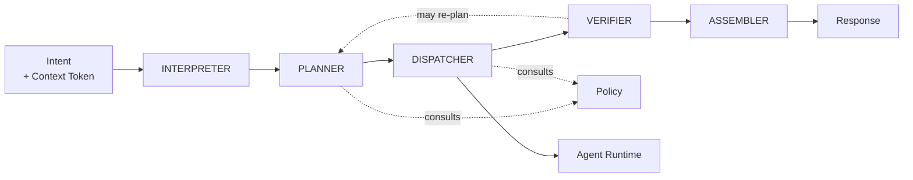

# Orchestration Architecture

**Status:** Proposed — Section 02.
**Covers:** the Orchestrator and the workflow engine.

---

## 1. The God-Object Problem

An orchestrator that interprets, plans, holds domain knowledge, decides permissions, calls
tools, manages credentials, and formats replies becomes the single unmaintainable centre
of the system. Every future feature lands in it; nothing can be tested in isolation; no
part can be replaced.

**The Orchestrator is therefore split into five components with narrow contracts**, and is
stripped of two responsibilities it must never hold.



| Component | Owns | Never owns |
| --- | --- | --- |
| **Interpreter** | Structured intent from expression | Deciding what to do about it |
| **Planner** | A plan: steps, dependencies, required rights | Executing anything |
| **Dispatcher** | Delegating steps to agents with narrowed tokens | Doing work itself |
| **Verifier** | Checking results against success criteria | Producing results |
| **Assembler** | The answer James sees, with what was done | Deciding what happened |

**The two responsibilities the Orchestrator must never hold:**

1. **Domain knowledge.** It does not know how KAIRO invoices work or what a good website
   is. That belongs to domain agents. An orchestrator that accumulates domain logic becomes
   the god-object by a slower route.
2. **Credentials.** It never holds a secret. Credentials resolve at the tool boundary.

---

## 2. Request Pipeline

```text
User Request
 ↓  Interpretation      what is being asked
 ↓  Context Resolution  where it applies      → ask if materially ambiguous
 ↓  Intent Classification  read? analyze? execute?  → sets risk class
 ↓  Planning            steps, dependencies, rights required
 ↓  Permission Evaluation  Policy: allow / deny / approval required
 ↓  Approval            James, if the risk class requires it
 ↓  Agent Selection     match responsibility, scope, rights
 ↓  Tool Selection      within each agent's closed list
 ↓  Execution           narrowed tokens, isolated instances
 ↓  Verification        against declared success criteria
 ↓  Result Assembly     result + what was done + what is uncertain
 ↓  User Response
```

Two properties of this order matter:

- **Permission is evaluated after planning but before any execution**, so the full plan is
  authorized as a unit rather than step-by-step surprises mid-execution.
- **Verification is a distinct stage.** "The tool returned 200" is not verification.
  Verification checks the declared success criteria — and may send the plan back.

---

## 3. Orchestrator Contract

**Inputs:** structured intent, Context Token, identity, conversation continuity,
constraints (cost/time/risk).

**Outputs:** the result, an account of what was done, unresolved items, epistemic labels
(Constitution §14), and a trace id.

**Non-responsibilities:** domain logic, credentials, tool implementation, authorization
decisions (it *asks* Policy), UI decisions, memory curation.

**Failure modes and responses:**

| Failure | Response |
| --- | --- |
| Intent unclear | Ask. Do not guess above `PREPARE` |
| Context ambiguous | Ask. Never pick the likelier scope |
| Permission denied | Report plainly, with what would be needed |
| No capable agent | Report the gap. Do not improvise with a wrong-fit agent |
| Step fails | Reliability policy: retry, compensate, or escalate |
| Partial completion | Report exactly what completed and what did not |
| Verification fails | Do not present as success. Re-plan or escalate |
| Approval denied | Stop. Leave no partial state |

**Escalation always goes upward** — to James, never sideways to another agent for a second
opinion that manufactures consent.

---

## 4. Workflow Engine

Workflows are durable, multi-step, resumable units of work. Anything spanning approvals,
external systems, or long durations is a workflow, not a request.

```text
Plan → Execute → Verify → Approve → Deploy → Monitor
```

**Required capabilities:**

| Capability | Requirement |
| --- | --- |
| Sequential | Ordered steps with explicit dependencies |
| Parallel | Independent steps concurrently, each in its own context |
| Dependencies | A step runs only when its prerequisites verified |
| Retries | Bounded, with backoff, only for idempotent steps |
| Pauses | Indefinite waits for approval or external events |
| Failures | Explicit handling; never silent |
| Resumption | Resume from last verified step, not from the beginning |
| Cancellation | Stoppable at any point, leaving a known state |

**State is durable and inspectable.** A workflow that cannot say which step it is on, what
it has done, and what it is waiting for cannot be recovered or trusted.

**Each step carries its own narrowed token.** A workflow spanning two clients holds no
token spanning both — it holds two, used separately.

**Partial completion is a first-class outcome**, not an error state to be hidden. Handling
is defined in [`RELIABILITY_ARCHITECTURE.md`](./RELIABILITY_ARCHITECTURE.md).
