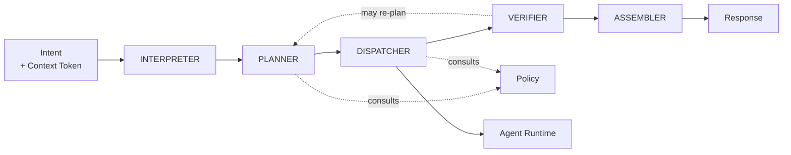

# Orchestration Architecture

**Status:** **Active** — Section 02, approved by James 2026-08-12.
**Covers:** the Orchestrator and the workflow engine.

---

## 1. The God-Object Problem

An orchestrator that interprets, plans, holds domain knowledge, decides permissions, calls
tools, manages credentials, and formats replies becomes the single unmaintainable centre
of the system. Every future feature lands in it; nothing can be tested in isolation; no
part can be replaced.

**The Orchestrator is therefore split into five components with narrow contracts**, and is
stripped of two responsibilities it must never hold.



| Component | Owns | Never owns |
| --- | --- | --- |
| **Interpreter** | Structured intent from expression | Deciding what to do about it |
| **Planner** | A plan — a **security object** with declared schema and identity (§2.1) | Executing anything; **authorizing the plan it produced** |
| **Dispatcher** | Delegating steps to agents with narrowed tokens | Doing work itself |
| **Verifier** | Checking results against success criteria | Producing results |
| **Assembler** | The answer James sees, with what was done | Deciding what happened |

**The two responsibilities the Orchestrator must never hold:**

1. **Domain knowledge.** It does not know how KAIRO invoices work or what a good website
   is. That belongs to domain agents. An orchestrator that accumulates domain logic becomes
   the god-object by a slower route.
2. **Credentials.** It never holds a secret. Credentials resolve at the tool boundary.

---

## 2. Request Pipeline

```text
User Request
 ↓  Interpretation      what is being asked
 ↓  Context Resolution  where it applies      → ask if materially ambiguous
 ↓  Intent Classification  read? analyze? execute?  → sets risk class
 ↓  Planning            steps, dependencies, rights required
 ↓  Permission Evaluation  Policy: allow / deny / approval required
 ↓  Approval            James, if the risk class requires it
 ↓  Agent Selection     match responsibility, scope, rights
 ↓  Tool Selection      within each agent's closed list
 ↓  Execution           narrowed tokens, isolated instances
 ↓  Verification        against declared success criteria
 ↓  Result Assembly     result + what was done + what is uncertain
 ↓  User Response
```

Two properties of this order matter:

- **Permission is evaluated after planning but before any execution**, so the full plan is
  authorized as a unit rather than step-by-step surprises mid-execution.
- **Verification is a distinct stage.** "The tool returned 200" is not verification.
  Verification checks the declared success criteria — and may send the plan back.

**A returned plan re-enters the pipeline at Planning, not at Execution.** ***PROPOSED — added by
Section 08, not yet accepted*** *(2026-08-14; authority
[ADR 0034](../decisions/0034-the-plan-is-a-security-object.md) and
[ADR 0035](../decisions/0035-section-08-amendments-to-accepted-architecture.md), both Proposed;
removed if either is rejected).* Re-planning produces a **new plan** with a new identity, which
passes through Permission Evaluation and Approval again (§2.1, §2.2, `I-113`). **A re-planned plan
never inherits the prior plan's authorization because the objective is unchanged.**

---

## 2.1 The Plan Is a Security Object

***PROPOSED — added by Section 08, not yet accepted*** *(2026-08-14; same authority as above).*

**The gap this closes.** §1 previously enumerated a plan as *"steps, dependencies, required
rights"* — three words in a table cell, and the only description of it in the repository. Every
other security object in NOVA has a declared schema: the Context Token
([`MASTER_ARCHITECTURE.md`](./MASTER_ARCHITECTURE.md) §2.2), a Delegation
([`SCOPE_AND_IDENTITY_MODEL.md`](./SCOPE_AND_IDENTITY_MODEL.md) §5), a Credential Binding
([`AUTHORIZATION_MODEL.md`](./AUTHORIZATION_MODEL.md) §5), a Session
([`AUTHENTICATION_MODEL.md`](./AUTHENTICATION_MODEL.md) §4), an agent definition, a tool definition.
**The plan was the one object the authorization model treats as its unit while having no structure**
— so `I-40`'s rule that untrusted content may not escalate a plan had nothing to attach to, `I-109`
had nothing to bind to, and nothing could detect a plan changing between authorization and
execution.

```text
Plan
├── identity            deterministic, derived as I-93 derives event identity
├── steps               ordered, each naming its action, resource and required rights
├── dependencies        which steps require which predecessors verified
├── required rights     the union the plan needs — never wider than the requester holds
├── declared risk class the highest class any step carries
├── scope               the single bound scope this plan operates in (I-95, I-86)
├── provenance/taint    the union of contributing provenance and the lowest trust among
│                       them, carried under I-99 and persisted under I-111
└── cost estimate       drawn against the root execution budget (I-105, I-108)
```

**`I-112` fixes four properties:**

**Identity is deterministic**, derived by the construction `I-93` already established for audit
records and `I-109` already reuses for approval binding. **No new identity mechanism is invented.**

**The plan is immutable once authorized.** Any material change — a step, a resource, a right, the
risk class, the scope, the tool set, the cost — **produces a new plan with a new identity requiring
new authorization.** A plan whose identity is reused after mutation is not the plan that was
authorized.

**Taint is a persisted security property, not prose.** The plan carries the union of its inputs'
provenance and the lowest trust among them, under `I-99` and `I-111` — **not a parallel provenance
system.** This is what makes `I-40` enforceable: a plan influenced by untrusted or quarantined
content carries that fact to the authorization boundary, and cannot exceed `PREPARE` without
approval naming the source. **`I-40` is not weakened; it is given the carrier it always required.**

**A plan is never authoritative because a model produced it.** The Planner is a model
([`MODEL_TRUST_AND_AUTHORITY.md`](./MODEL_TRUST_AND_AUTHORITY.md) §1), its output is
`model.generated` at low trust (`I-99`), and producing a plan confers nothing (`I-20`). The plan
becomes authoritative only when authorized — never before, and never by assertion.

---

## 2.2 Envelope Authorization and Per-Action Checking

***PROPOSED — added by Section 08, not yet accepted*** *(2026-08-14; same authority as above).*

**Four accepted documents described plan authorization at three different granularities:** §2 above
(*"the full plan is authorized as a unit"*), `AUTHORIZATION_MODEL.md` §1 and §3 (*"this **specific
action** against this **specific resource**"*, ten singular steps),
`PERMISSION_ARCHITECTURE.md` §5 (*"one action, in one context, at one time"*), and
`EXECUTION_ARCHITECTURE.md` §2.1 (*"James approves the plan"*). An engineer building the
Planner→PDP interface had to choose between defensible readings that produce materially different
systems. **`I-113` reconciles them without amending the PDP.**

```text
Plan authorization  → ENVELOPE: scope, risk ceiling, tool set, cost ceiling, composition
Each action         → the unmodified ten-step sequence, at its own enforcement point
                      ∈ envelope → proceed
                      ∉ envelope → deny, even if the action alone would be permitted
```

**Neither substitutes for the other.** Plan authorization **never** replaces per-action
authorization, and per-action authorization **never** permits exceeding the envelope. This is the
same structure `MT-8` uses for tool arguments and `I-106` uses for token issuance — a third
application of a pattern the architecture already relies on, not a new one.

**Composition is bounded by the envelope.** A plan's individually permissible actions **must not
exceed the authorized envelope when taken together.** Permitted read + permitted write + permitted
send do not silently compose into an unauthorized higher-level operation. The plan declares enough
(§2.1) for enforcement to evaluate the collection rather than only its members.

**The PDP is not modified and does not become a composition engine.** It keeps evaluating exactly
what it evaluates today; the envelope constrains what may be submitted to it. `P-7` and `P-11`
stand.

**Stated honestly:** this makes composition **governable, not solved.** A plan whose declared
envelope is wide enough to contain a dangerous sequence is authorized correctly and is still
dangerous — the same limit ADR 0025 records for over-wide argument envelopes.

---

## 3. Orchestrator Contract

**Inputs:** structured intent, Context Token, identity, conversation continuity,
constraints (cost/time/risk).

**Outputs:** the result, an account of what was done, unresolved items, epistemic labels
(Constitution §14), and a trace id.

**Non-responsibilities:** domain logic, credentials, tool implementation, authorization
decisions (it *asks* Policy), UI decisions, memory curation.

**Failure modes and responses:**

| Failure | Response |
| --- | --- |
| Intent unclear | Ask. Do not guess above `PREPARE` |
| Context ambiguous | Ask. Never pick the likelier scope |
| Permission denied | Report plainly, with what would be needed |
| No capable agent | Report the gap. Do not improvise with a wrong-fit agent |
| Step fails | Reliability policy: retry, compensate, or escalate |
| Partial completion | Report exactly what completed and what did not |
| Verification fails | Do not present as success. Re-plan or escalate |
| Approval denied | Stop. Leave no partial state |

**Escalation always goes upward** — to James, never sideways to another agent for a second
opinion that manufactures consent.

---

## 4. Workflow Engine

Workflows are durable, multi-step, resumable units of work. Anything spanning approvals,
external systems, or long durations is a workflow, not a request.

```text
Plan → Execute → Verify → Approve → Deploy → Monitor
```

**Required capabilities:**

| Capability | Requirement |
| --- | --- |
| Sequential | Ordered steps with explicit dependencies |
| Parallel | Independent steps concurrently, each in its own context |
| Dependencies | A step runs only when its prerequisites verified |
| Retries | Bounded, with backoff, only for idempotent steps |
| Pauses | Indefinite waits for approval or external events |
| Failures | Explicit handling; never silent |
| Resumption | Resume from last verified step, not from the beginning |
| Cancellation | Stoppable at any point, leaving a known state |

**State is durable and inspectable.** A workflow that cannot say which step it is on, what
it has done, and what it is waiting for cannot be recovered or trusted.

**Each step carries its own narrowed token.** A workflow spanning two clients holds no
token spanning both — it holds two, used separately.

**Partial completion is a first-class outcome**, not an error state to be hidden. Handling
is defined in [`RELIABILITY_ARCHITECTURE.md`](./RELIABILITY_ARCHITECTURE.md).

**Resumption re-checks the authorization binding.** ***PROPOSED — added by Section 08, not yet
accepted*** *(2026-08-14; same authority as §2.1).* A workflow that resumes from its last verified
step re-checks `I-109`'s binding against **current** state before the next step, and **fails closed**
if it no longer matches (`I-113`). This is the case §3 of
[`RELIABILITY_ARCHITECTURE.md`](./RELIABILITY_ARCHITECTURE.md) describes as normal: a plan's first
action changes the world, and the authorization for its second action was evaluated against the
world before that change. **Resumption is not a continuation of the old authorization; it is a fresh
check of whether the old authorization still holds.**

---

## 5. Automations — Intent, Not Authority

> ***PROPOSED — added by Section 12, not yet accepted*** *(2026-08-15; authority
> [ADR 0038](../decisions/0038-automations-are-intent-not-authority.md), Proposed; removed and the
> accepted text restored verbatim if rejected).* §4 defines what a workflow **is** and what the
> engine must **do**. It did not say what a **stored** workflow plus a **trigger** carries across
> time — and the industry default answer is that the definition is authorized once, at save time,
> and the scheduler runs it thereafter. **That reading is the single largest available loophole
> around Sections 01–11**, and it is excluded by rules that already exist. This section performs
> the composition so it cannot be re-derived wrongly.

**An automation is a stored workflow definition plus the trigger or schedule that fires it.**

> **An automation is intent. It is never authority.**
> **Every firing is authorized freshly, at fire time, through the unmodified §2 pipeline.**

**Nothing carries authorization forward** — not the definition, not the trigger, not the schedule,
not a previous firing, not a previous approval.

### 5.1 What each part is

| Part | Is | Is never |
| --- | --- | --- |
| **Definition** | A stored statement of *what to ask for*, and under what conditions | A grant, a plan, a standing approval, or a security object that fixes authority |
| **Trigger / schedule** | An **event** — data (§2 of [`EVENT_AND_OBSERVABILITY_ARCHITECTURE.md`](./EVENT_AND_OBSERVABILITY_ARCHITECTURE.md)). It says **when** | An identity, an authorization source, or a reason to skip a step |
| **Firing** | One ordinary trip through the §2 pipeline | A resumption of the last firing |
| **Run** | A workflow instance with durable step state (§4) | A thing that outlives its authorization |

**The definition is deliberately not a security object.** Agent definitions, tool definitions,
plans and execution bindings are, because each **fixes authority**: an agent definition sets
Permissions, Allowed Context and Allowed Tools, which is why registering one is C2 and setting its
authority C3. **An automation definition fixes none.** The authority a firing exercises lives
entirely in James's grants (`I-10`), standing approvals, agent definitions, tool declarations and
bindings — each already governed. So creating or editing an automation is **configuration**, and
what bounds it is the closed capability surface: an agent can create one only if that capability is
on its closed tool list, and granting that is C3 (`IDENTITY_AND_AUTHORITY.md` §5). **A mutated
definition needs no re-approval because it authorizes nothing** — its next firing is authorized on
its own terms, and denies if the grants no longer support it (`I-14`).

**A schedule event carries no more authority than an external one.** ADR 0037 (`S11-D3`) settled
that a provider-initiated signal has no identity, token or grant. **A NOVA-produced schedule event
is not an exception:** it is produced inside NOVA, so it is not *untrusted* in the `external.web`
sense, but "NOVA emitted it" is **not** "NOVA's authority attends it". It selects a moment; the
pipeline decides everything else. **Trigger content never sets scope, risk class, tool set, or
argument values** beyond what the firing's own authorization independently permits — untrusted
trigger content may **inform** the resulting plan and may never **escalate** it (`I-40`), carrying
its taint under `I-99` and persisting under `I-111`.

### 5.2 Who acts when James is not present

**The actor is the NOVA system identity** — already defined for exactly this
([`IDENTITY_AND_AUTHORITY.md`](./IDENTITY_AND_AUTHORITY.md) §2: *"the platform acting on James's
behalf for scheduled and autonomous work"*), deliberately distinct from James so the audit trail
never confuses *"NOVA did this automatically"* with *"James asked for this"*. **Its ceiling is
whatever James has delegated, minus anything requiring explicit human approval.**

**"James created the automation, therefore the firing is James" is false**, and is the reading this
section exists to exclude. James's authorship is recorded provenance; it is not the actor, and it
is not a grant.

**So an automation runs unattended only up to the autonomous ceiling.** Within an authorized
context that is `READ`–`PREPARE` (`PERMISSION_ARCHITECTURE.md` §4–5). Beyond it, unattended
execution requires a **standing approval** — which exists, is *"recorded as grants"*, and is
bounded by scope, risk ceiling, expiry and rate limit, and revocable. **`IRREVERSIBLE` is never
autonomous**, standing approval or not. Anything above the ceiling without a covering standing
approval **pauses at Approval** (§4's indefinite pause) rather than proceeding.

**No automation can satisfy its own approval requirement.** `I-09` is explicit — *"no system,
agent, or automation may record an approval"* — and break-glass is human-only (`B-2`,
[`SECURITY_OPERATIONS.md`](./SECURITY_OPERATIONS.md) §3). The approval boundary therefore cannot be
routed around by having one automation approve another's work: escalation is upward to James only
(§3), never sideways to something that manufactures consent.

### 5.3 What is re-checked, and when

Everything below is an existing rule; none is new here.

```text
At each firing        fresh plan, fresh identity          I-112
                      Permission Evaluation               §2 pipeline ordering
                      grants / delegation / expiry        I-14, I-107
                      risk class from the action          I-101
                      approval if required                I-109 binds the plan's properties
Within a run          per-action authorization            I-113
                      resolved binding ∈ envelope         I-114
On resume             I-109 binding re-checked vs current state, fail closed
On retry / failover   binding re-resolved and re-checked per attempt   I-114(b)
Continuously          revocation at next enforcement point             V-2
                      emergency stop at enforcement points             X-1, X-3, X-7
```

**A firing never inherits from the previous firing**, and *"the objective is unchanged"* is never a
reason to inherit — `I-113` forbids exactly that for re-planning, and a recurring automation is the
same argument spread over time. **An approval is never a precedent** (`PERMISSION_ARCHITECTURE.md`
§5), so approving Tuesday's firing does not approve Wednesday's.

**Caching allows across firings is prohibited.** `I-17` permits read-decision caching within one
context's lifetime, invalidated by revocation or emergency stop — **and nothing wider.** A cache
spanning firings is save-time authorization rebuilt under another name.

**Composition is bounded as it already is.** An automation that invokes another manufactures no
authority: the second is delegation if it runs as a child (`I-106`, `I-107` — strictly narrowing,
expiring earlier, never outliving its delegator) or an independent firing authorized on
its own terms. **Neither path can be wider than its initiator**, and delegation ancestry persists
under `I-111`.

### 5.4 Failure states are not collapsed

A run reports which of these it is in, because they demand different responses and *"failed"*
hides the difference:

```text
succeeded · partially completed · unknown (RELIABILITY §2 — never "failed")
failed · denied · revoked · expired · awaiting approval · escalated
paused · cancelled · stopped · unavailable
```

**`unknown` is never resolved by assumption** and never auto-retried into a duplicate side effect
([`RELIABILITY_ARCHITECTURE.md`](./RELIABILITY_ARCHITECTURE.md) §2, §4). **`denied`, `revoked` and
`expired` are terminal for that firing** — they are not transient conditions to retry around; the
next firing re-asks, and if the answer is still no it denies again. A run **paused** awaiting
approval holds no authorization while it waits: it is re-authorized when it proceeds, not when it
paused.
