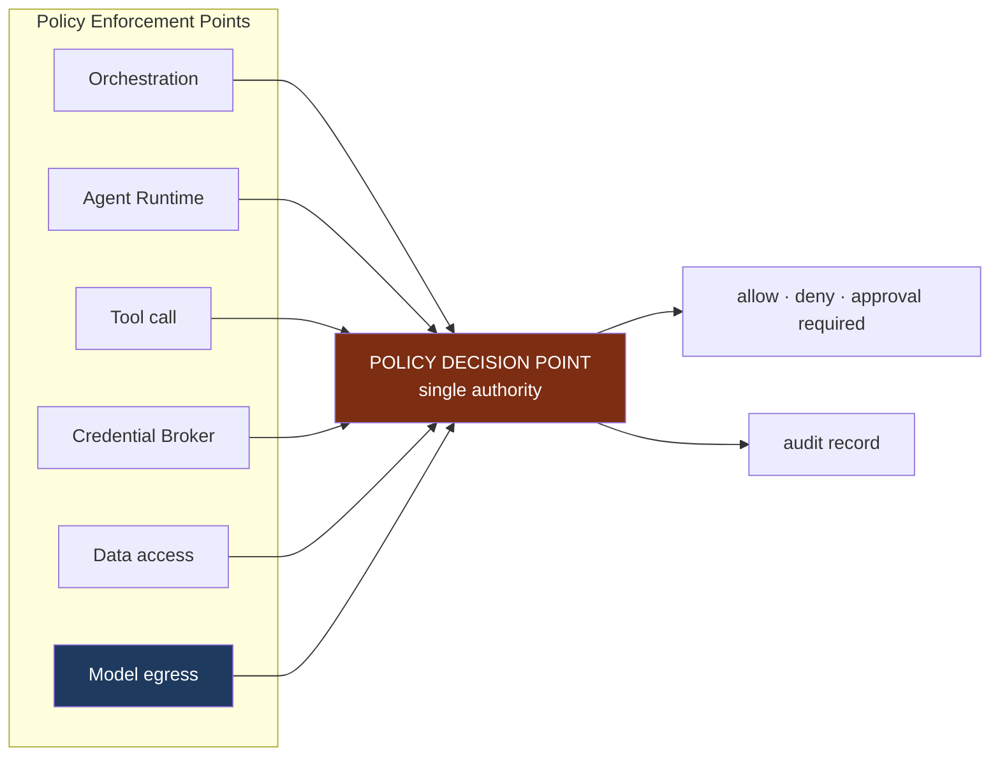

# Permission Architecture

**Status:** **Active** — Section 02, approved by James 2026-08-12.
**Covers:** the permission model, action risk classification, approvals, and human control.

---

## 1. The Question the System Must Answer

> **Who** may do **what**, to **which resource**, in **which context**, using **which
> tool**, at **what risk**, and with **what approval**?

Seven dimensions. A model answering fewer produces either an unusable system or an unsafe
one.

```text
Permission = (identity | role) × right × resource type × scope × risk ceiling × conditions
```

---

## 2. One Decision Point, Many Enforcement Points



**One place decides; six places enforce.** Scattering authorization logic across
orchestration and tool code is how isolation quietly rots — each site drifts, and no one
can answer "what is actually enforced?" A single PDP is testable in isolation
([`TESTING_ARCHITECTURE.md`](./TESTING_ARCHITECTURE.md)).

**Default deny.** Absence of a grant is a denial. Absence of an explicit *denial* is not a
grant ([`../ai/AGENT_PRINCIPLES.md`](../ai/AGENT_PRINCIPLES.md) §3).

**A token failing integrity detection is not a valid token at any of the five points.**
*(Added 2026-08-13, N-6 — proposed through Section 04.)* Each enforcement point must be able to
detect a Context Token modified after issuance or fabricated by anything other than the Context
service, and must refuse it — no channel, no decision, no call, denied and recorded (`I-87`,
`CT-1`–`CT-3`, [`AUTHENTICATION_MODEL.md`](./AUTHENTICATION_MODEL.md) §6). This is a **detection**
requirement on a mechanism that does not yet exist (`I-87` is `[PHYS]`); **forgery is not claimed
to be impossible**, and it does nothing against a compromised Context service issuing genuine
tokens (`T-23a`).

**Model egress is the sixth enforcement point.** ***Added by Section 05 — ACCEPTED by James 2026-08-14*** *(2026-08-14; this file is Active Section 02 material, so this paragraph and the
`Model egress` node above are amendments proposed through
[ADR 0024](../decisions/0024-model-gateway-is-an-enforcement-point.md) and
[ADR 0028](../decisions/0028-section-05-amendments-to-accepted-architecture.md), both
**Accepted** 2026-08-14.)* Every model call is an authorization decision evaluated per call against the
Context Token, the classification of every item in the request, and the destination provider
(`I-94`, [`MODEL_GATEWAY_ARCHITECTURE.md`](./MODEL_GATEWAY_ARCHITECTURE.md) §2). Model egress is
the point at which NOVA's data leaves NOVA's trust boundary to a third party; before Section 05 it
was the only such path with no named enforcement point, which is why emergency stop (`I-19`) and
revocation (`I-74`) — both defined as taking effect *at* enforcement points — did not reach it.
**The gateway decides nothing** (`I-77`): like every enforcement point it can only deny.

**All five original enforcement points remain in force after Section 04.** *(Noted 2026-08-12, H-1.)*
Section 04 adds a structural storage isolation layer beneath the **Data access** PEP
([ADR 0016](../decisions/0016-isolation-enforced-below-query-layer.md),
[ADR 0017](../decisions/0017-isolation-independent-of-pdp.md)). It is **additional**: the Data
access PEP still asks the PDP for every access, and the isolation layer decides nothing about
authorization. Neither replaces the other (`I-77`).

---

## 3. Grants and Scopes

A grant names identity/role, right, resource type, scope, risk ceiling, and conditions
(time bounds, approval requirements, rate limits).

**Grants are inherited downward and never sideways or upward.** A grant over
`/business/KAIRO/client-a` covers its projects and environments. It says nothing about
Client B and nothing about KAIRO as a whole.

**Temporary permissions** carry a mandatory expiry, are recorded on issue and expiry, and
are used for exactly the pattern that otherwise causes permanent over-permissioning: "the
agent needs this once."

**Credential scopes are separate from permissions.** A permission says NOVA *may* act; a
credential is *how* it reaches outward. Holding one never implies the other.

---

## 4. Action Risk Classification

Every action carries a risk class. This is what allows James to stay in control without
approving trivia.

| Class | Meaning | Reversible | Default |
| --- | --- | --- | --- |
| **READ** | Observe existing information | n/a | Autonomous |
| **ANALYZE** | Reason over information | n/a | Autonomous |
| **RECOMMEND** | Propose a course of action | n/a | Autonomous |
| **PREPARE** | Stage a change without committing it | Yes | Autonomous |
| **EXECUTE** | Make a change of limited consequence | Usually | Contextual approval |
| **HIGH-IMPACT EXECUTE** | Change affecting clients, money, or production | Difficult | **Explicit approval** |
| **IRREVERSIBLE** | Cannot be undone | **No** | **Explicit approval, never autonomous** |

**Examples.** Reading a client's analytics is `READ`. Drafting the client email is
`PREPARE`. Sending it is `EXECUTE`. Deploying to their production site is `HIGH-IMPACT
EXECUTE`. Deleting their database, sending an SMS campaign to their customer list, or
moving money is `IRREVERSIBLE`.

**The productive consequence:** NOVA can do an enormous amount of useful work — research,
analysis, drafting, staging, planning entire client builds — with no approvals at all.
Approval is concentrated where consequences are, which is what makes it meaningful rather
than reflexive.

**Classification rules.** Risk is a property of the *action in its context*, not the tool.
The same "send email" tool is `EXECUTE` for an internal note and `IRREVERSIBLE` for a bulk
send to a client's customers. When a classification is uncertain, the higher class applies.
Risk may be raised by scope (production, client-facing, financial) but never lowered by an
agent.

---

## 5. Approval Policies

| Mode | When | Behaviour |
| --- | --- | --- |
| **Fully autonomous** | READ–PREPARE within an authorized context | Acts; records; reports |
| **Low-risk approval** | EXECUTE, routine and reversible | May batch or use standing approvals with limits |
| **High-risk approval** | HIGH-IMPACT EXECUTE | Explicit per-action approval, showing what will change |
| **Explicit human command** | IRREVERSIBLE | James must initiate, not merely consent |
| **Emergency stop** | Any time | Halts all autonomous work immediately |

**Standing approvals** ("deploy Client A's staging without asking") are permitted, bounded
by scope, risk ceiling, expiry, and rate limit — and revocable. They are recorded as grants
so that what NOVA may do autonomously is always inspectable.

**An approval authorizes one action, in one context, at one time.** It never becomes a
precedent, and it is never inferred from a previous approval.

**What makes it the *same* action at execution time.** ***PROPOSED — added by Section 06, not yet
accepted*** *(2026-08-14; authority
[ADR 0030](../decisions/0030-agent-governance-and-approval-binding.md) and
[ADR 0031](../decisions/0031-section-06-amendments-to-accepted-architecture.md), both Proposed;
removed if either is rejected).* The sentence above fixes **how many times** an approval may be
used. It did not fix **what it is an approval of** — so between approval and execution the agent
definition, its tool set, its effective rights, its delegation chain or its budget could change and
the approval would still appear to apply.

**Nine properties are binding** (`I-109`): action · resource · scope · effective rights · risk
class · tool set · argument envelope (`I-100`) · delegation ancestry · cost ceiling.

**Explicitly not binding:** model, provider, capability profile, the **ephemeral agent instance
identity**, wording, formatting, ordering, and other implementation metadata. Instances are
ephemeral *by design*, so binding to one would make every approval stale on principle and train the
reflexive re-approval [`KNOWN_RISKS.md`](./KNOWN_RISKS.md) records as a security failure. Model and
provider are excluded because Section 05 already decides egress per call (`I-94`, `I-97`).

**The binding reuses `I-93`'s deterministic-identity construction — no cryptography is invented.**
If it differs at execution the approval does not apply, execution does not proceed under it, and
fresh approval is required where the risk class requires approval at all. **The property:** an
approved action cannot silently become a materially different action because the agent executing it
changed.

**Approval requests must be answerable.** A request stating what will change, in which
scope, what it costs, and what happens if it is wrong is a decision James can make in
seconds. A request saying "approve this workflow?" is not.

---

## 6. Emergency Stop

Required by Constitution §11. Guarantees:

1. **Always reachable** — from any surface, at any time, without navigating.
2. **Immediate** — new work is refused and in-flight autonomous work halts at its next
   checkpoint.
3. **Fails closed** — components that cannot confirm the stop must refuse to proceed.
4. **Leaves a known state** — what stopped, what completed, what is partial.
5. **Does not require NOVA's cooperation** — a stop must not depend on the orchestrator
   being healthy. An unhealthy orchestrator is exactly when it is needed.

Point 5 is the design constraint that matters: the stop is enforced at the enforcement
points, not requested politely of the thing being stopped.

Resumption after a stop is always an explicit human act.

**Mechanics are specified in Section 04:** [`SECURITY_OPERATIONS.md`](./SECURITY_OPERATIONS.md)
§2 (emergency stop), §1 (revocation timing), §3 (break-glass).

---

## 7. Least Privilege in Practice

- Agents receive the narrowest token that lets them finish, not their maximum allowed scope.
- Tokens expire with the work.
- Tools declare the minimum rights they need; a tool asking for more than it uses is a
  defect.
- Credentials are brokered per call, never held by agents.
- Temporary elevations expire automatically.
- No component may widen its own authority — the architecture provides no mechanism for it.
