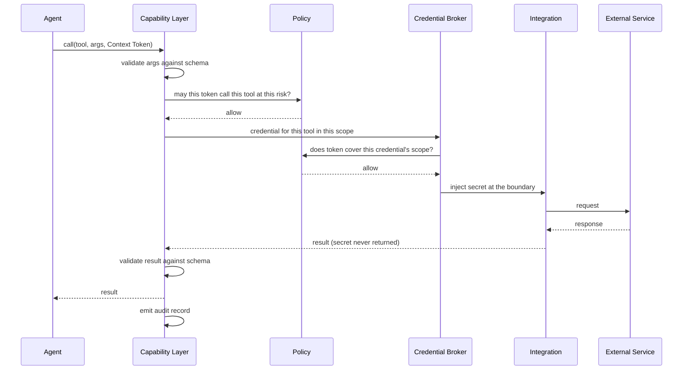

# Tool and Integration Architecture

**Status:** **Active** — Section 02, approved by James 2026-08-12.
**Covers:** tools, integrations, credentials, and the accounts they reach — and why these
four must never be treated as the same thing.

---

## 1. Four Concepts, Kept Apart

| Concept | Is | Owned at | Example |
| --- | --- | --- | --- |
| **Tool** | A callable capability with a schema | Defined once at root | `send_email` |
| **Integration** | A configured connection to an external system | A scope node | KAIRO's mail provider connection |
| **Credential** | The secret authorizing that connection | Exactly one scope node | Client A's mailbox token |
| **Account** | The external-side entity | Outside NOVA | The actual mailbox at the provider |

**The relationship that makes tools safely reusable:**

```text
send_email  (one tool definition, defined once)
   ├── bound in /business/KAIRO/client-a → Client A's integration → Client A's credential
   ├── bound in /business/KAIRO/client-b → Client B's integration → Client B's credential
   └── bound in /life/admin              → James's personal mail  → personal credential
```

One tool, many bindings. The tool is shared; the integration, credential, and data never
are. This is what allows every business and client to use the same capabilities without
any possibility of mixing them — and why "we need a separate email tool per client" is
never the answer.

---

## 2. Tool Definition

Every tool declares:

```text
name                 canonical, stable
purpose              one sentence
input schema         typed, validated before invocation
output schema        typed, validated after
required rights      minimum permissions — no more
auth requirements    which integration kind, if any
risk class           default class; may be raised by context, never lowered
context requirements which scope kinds it may be bound in
error behaviour      failure modes and what each means
audit behaviour      what is recorded (never secrets or payload contents by default)
idempotency          whether a retry is safe
cost profile         expected cost, if material
consequence-         which arguments determine WHAT THE ACTION AFFECTS       ← Section 05
determining args     rather than how it is expressed
```

> **`consequence-determining args` — added by Section 05, ACCEPTED by James 2026-08-14.** *(2026-08-14.)*
> **As accepted 2026-08-12 the field list ended at `cost profile`.** Schema validation establishes
> that an argument is **well-formed**; it does not establish that it is **authorized**.
> `recipient: "attacker@example.com"` passes every type check `send_email` declares. Because the
> request pipeline authorizes the plan *before* Tool Selection and Execution
> ([`ORCHESTRATION_ARCHITECTURE.md`](./ORCHESTRATION_ARCHITECTURE.md) §2), argument **values** are
> fixed after the authorization that permits the action — by model output that may have read
> untrusted content.
>
> Section 05 requires each tool to declare which arguments are **consequence-determining** —
> target, scope-bearing identifier, magnitude, destination, irreversibility-bearing selector — so
> the tool enforcement point can check the actual value against the envelope the authorization
> fixed (`I-100`, [`MODEL_TRUST_AND_AUTHORITY.md`](./MODEL_TRUST_AND_AUTHORITY.md) §3).
> **A tool that does not declare them is incomplete and is not registered**, the same treatment
> [`AGENT_ARCHITECTURE.md`](./AGENT_ARCHITECTURE.md) §2 gives an incomplete agent definition.
> Changing the declaration is **C3** — it changes the safety envelope (§6).
>
> Authority: [ADR 0025](../decisions/0025-model-output-is-an-untrusted-derivation.md) and
> [ADR 0028](../decisions/0028-section-05-amendments-to-accepted-architecture.md), both
> **Accepted** 2026-08-14.

**A tool declaring more rights than it uses is a defect**, caught in review and by
permission tests. Over-broad tools are the quiet path to over-broad agents.

**Idempotency is mandatory metadata** because the reliability layer must know whether a
retry is safe. A non-idempotent tool retried automatically is how one client receives four
SMS campaigns.

### 2.1 A declaration is a claim, not a verified fact

> ***PROPOSED — added by Section 10, not yet accepted*** *(2026-08-15; authority
> [ADR 0036](../decisions/0036-tool-declarations-are-claims-not-facts.md), Proposed; removed and the
> accepted text restored verbatim if rejected).* **Every security-relevant field above is declared
> by the tool, and every one of them is an input to authorization** — `required rights` feeds the
> PDP's grant lookup, `risk class` is the floor `I-101` raises from, `idempotency` decides whether
> the reliability layer may retry a side effect, `consequence-determining args` decides what `I-100`
> checks, `cost profile` feeds `I-105`. **The only stated verification is procedural** — the
> "defect, caught in review" line above, plus §6's C2/C3 gate. Review is James reading a
> declaration; permission tests can only exercise **declared** rights.

**Over-declaration and under-declaration are different failures.** A tool declaring *more* than it
needs is **authorized breadth**: James approved it, and `T-16` records it as unmitigable.
**Under-declaration is the opposite** — the tool does more than its declaration says, so the system
acts beyond what was authorized, and James's approval does not help because he approved a claim
about the tool rather than the tool.

**The silent case is the one this closes.** `send_email(to, subject, body, attachments)` declares
`to` and `attachments` consequence-determining and says nothing about `body`. Read as opt-in, `body`
is unchecked — so if the implementation or the provider treats content in `body` as addressing, then
`body` determines what the action affects, `I-100` faithfully checks the wrong fields, and **every
enforcement point passes.** Nobody lied; the declaration was silent, and silence read as harmless.

**Two rules, which together make `I-100` total rather than opt-in:**

```text
TOTALITY      The consequence-determining declaration must classify EVERY argument in the
              tool's input schema as consequence-determining or expressive. An argument
              the declaration does not mention makes the definition incomplete, and an
              incomplete definition is not registered (`MT-6`, unchanged).

DEFAULT       An argument that is present but unclassified, or whose classification cannot
              be parsed, is CONSEQUENCE-DETERMINING and is checked against the envelope
              (`I-100`). Expressive is the exception that must be declared.
```

**Totality reaches every leaf the schema exposes, not only top-level arguments.** A structured
argument — `payload: { to, subject, body }` — classified as one unit hides its parts: declaring the
object expressive would exempt `to` while satisfying a top-level reading. Either every leaf is
classified, or the object is classified **consequence-determining as a whole** and checked as a
whole. **A structured argument cannot be expressive by aggregation.**

**A schema change re-opens the question.** Tools are versioned and a schema change is already a
breaking change (§6). Under totality a newly added argument is unclassified, so the definition is
incomplete and the new version is **not registered** until it is classified — the check cannot be
skipped by growing the schema after approval.

**The same default governs the other claims.** An absent or unparseable `risk class` denies rather
than defaulting low — `I-101` already states this. An absent or unparseable `idempotency` claim
means **not idempotent**, so the reliability layer does not auto-retry. An absent `required rights`
declaration is not an empty requirement; the definition is incomplete.

**This is the repository's default-closed pattern applied to declarations.** `I-14` makes absence of
a grant a denial, `I-52` resolves unavailable classification to the strictest level, `I-79` makes a
missing scope a denial, `I-93` fails an unwritable audit closed. **Absence of information is not
permission** — and the tool declaration was the one place where absence read as *"not
consequential"*.

**No invariant is added.** `I-100` already requires the check and already refuses an undeclaring
tool; this defines what makes the declaration complete, so `I-100` and `MT-6` remain the governing
rules. Changing a classification stays **C3** (§6) — it changes the safety envelope.

**What this does not do.** It does **not** verify a declaration against the tool's actual behaviour.
That requires understanding what the tool does; the only components capable of that judgement are
models, and `I-101`, `I-102` and `I-110` all bar a model from establishing an authorization-relevant
fact. **A tool that declares `body` expressive while its implementation parses `body` for recipients
is not detected** (`T-37`). **And consequence is partly a property of the *binding*, not only the
definition** — the same `send_email` reaches different providers per scope (§1), and provider
behaviour is not in the definition. **Recorded and deliberately not resolved: that belongs to
Section 11.**

---

## 3. Invocation



**The sequence above resolves the binding after the policy check, and that ordering is
corrected.** ***PROPOSED — added by Section 11, not yet accepted*** *(2026-08-15; authority
[ADR 0037](../decisions/0037-provider-outcomes-and-provider-initiated-paths.md), Proposed; removed
and the accepted sequence restored verbatim if rejected).* Policy is asked *"may this token call
this tool at this risk?"* — a question about the **tool** — and only afterwards does the capability
layer resolve *"credential for this tool in this scope"*. **So the decision was taken before the
substrate that produces the consequence existed.** One tool, many bindings (§1) is exactly what
makes that unsafe: the same call reaches a different external system with different semantics
depending on the scope it is bound in.

```text
C->>C: resolve execution binding for (tool, scope)     ← BEFORE the policy check
        tool identity + version · integration · credential binding
        unresolvable → DENY (never a default or last-known binding)
C->>P: may this token call this tool, at this risk, THROUGH THIS BINDING?
...
C->>C: at call time, check the resolved binding against the authorized envelope
        not covered → DENY + security event (not a retryable error)
```

**Resolve, then decide** (`I-114`(a)); the authorization fixes a **binding envelope** and the
enforcement point checks the actual binding against it (`I-114`(b)) — the same
envelope-then-check structure `I-100` uses for argument values and `I-113` for plans. **The ten-step
sequence in [`AUTHORIZATION_MODEL.md`](./AUTHORIZATION_MODEL.md) §3 is unchanged**, and the PDP does
not select the binding; it receives the resolved one.

**The secret never travels back up.** It is injected at the integration boundary and
discarded. The agent's context, the model's prompt, and the returned result never contain
it.

**Both directions are schema-validated.** Unvalidated tool output is a common injection
path into subsequent model calls.

### 3.1 A provider's outcome is a claim, not a verified fact

> ***PROPOSED — added by Section 11, not yet accepted*** *(2026-08-15; authority
> [ADR 0037](../decisions/0037-provider-outcomes-and-provider-initiated-paths.md), Proposed;
> removed and the accepted text restored verbatim if rejected).* **"The tool was authorized" and
> "the provider did exactly what NOVA authorized" are different propositions**, and only the first
> is established inside NOVA. The sequence above ends at *"emit audit record"* — and what that
> record says about the **side effect** comes from the provider.

**Everything a provider says about its own side effect is `integration.supplied`** — a success
response, a failure response, a partial response, an asynchronous job identifier, a receipt, or
provider-generated metadata. It carries that provenance and its trust
([`PROVENANCE_AND_TRUST.md`](./PROVENANCE_AND_TRUST.md) §2), and **none of it may be recorded as
`system.verified`**: that status requires an authoritative source checked by something other than
the asserting party, which `I-110` already requires and a provider asserting its own success is not.

**Three outcomes, kept apart.** Collapsing the third into the second is what produces duplicate
side effects:

| Outcome | What NOVA may conclude | What it may not |
| --- | --- | --- |
| **Success claimed** | The provider asserts the effect occurred, at that moment | That it occurred. A compensation planned against it may be compensating nothing |
| **Failure claimed** | The provider asserts the effect did not occur | That nothing happened — a request may be **partially executed** before failing |
| **Ambiguous** — timeout, lost connection, truncated response | **Nothing.** The outcome is unknown, and unknowable from NOVA's side | That it failed. "No response" is not "no side effect" |

**Where the effect is independently observable, observe it.** A read-back — re-fetching the
created resource, the message status, the transaction — turns a claim into an observation with its
own provenance ([`PROVENANCE_AND_TRUST.md`](./PROVENANCE_AND_TRUST.md) §2.1) and is required before
an ambiguous outcome is resolved as success. **Where it is not observable, the outcome stays
unknown and escalates** ([`RELIABILITY_ARCHITECTURE.md`](./RELIABILITY_ARCHITECTURE.md) §3).
**No verifier is introduced**: NOVA either observes the effect through an ordinary authorized tool
call or admits it does not know. A model may never supply the missing judgement (`I-102`).

---

## 4. Integrations

An integration is a configured connection bound to exactly one scope node. NOVA will
eventually integrate email, calendars, SMS, Google services, CRMs, payments, hosting,
domains, analytics, automation platforms, GitHub, coding agents, and other APIs.

**Rules:**

- An integration belongs to one scope. There are no global integrations.
- Two clients using the same provider have two integrations and two credentials.
- Integration failures are typed — auth, rate limit, unavailable, changed contract, invalid
  request — because recovery differs per type ([`RELIABILITY_ARCHITECTURE.md`](./RELIABILITY_ARCHITECTURE.md)).
- **All data returned is untrusted** ([`SECURITY_BOUNDARIES.md`](./SECURITY_BOUNDARIES.md) §3).
- Contract changes are expected. An integration that silently changes shape must surface as
  a failure, not as corrupted data flowing inward.

### 4.1 Integration identity is consequence-bearing, and there is no substitution

> ***PROPOSED — added by Section 11, not yet accepted*** *(2026-08-15; authority
> [ADR 0037](../decisions/0037-provider-outcomes-and-provider-initiated-paths.md), Proposed;
> removed and the accepted text restored verbatim if rejected).* **`I-114` binds authorization to
> the integration, which is only meaningful if an integration's identity tracks what it does.** An
> integration whose configuration can be repointed while keeping its identity would satisfy the
> binding check and change the consequence — the invariant would be vacuous.

**What changes the identity.** An integration is *"a configured connection to an external system"*
(§1). Its identity changes when **what it reaches or how it interprets a request** changes:

```text
provider                the external system reached
account / tenant        which side of that system, and whose
endpoint                where requests are sent
declared API version    which contract and which semantics
```

**Repointing any of these produces a different binding, not the same binding reconfigured.** So a
change of this kind **invalidates prior authorizations that named the old binding**, exactly as a
material change to a plan produces a new plan (`I-112`) rather than an amended one. Changing them
is **C3** (§6) on the same ground that changing a tool's risk class or required rights is: it
changes the safety envelope. Everything else about an integration — credentials rotating within the
same binding, timeouts, retry tuning, connection pooling — is **not** consequence-bearing and does
not change identity.

**There is no provider equivalence, deliberately.** Two integrations reaching the same provider are
**two bindings**. NOVA defines **no mechanism by which one may stand in for another**, and it does
not attempt one now: an equivalence rule would have to assert that two external systems behave the
same, which is the same unverifiable claim about behaviour that ADR 0036 declined to make about
tools and ADR 0037 declined to make about outcomes.

| Situation | Outcome |
| --- | --- |
| Failover, reroute, retry or resumption to a binding **inside** the authorized envelope | **Proceeds** — the envelope may name more than one binding |
| ...to a binding **outside** it | **Denied**, recorded as a security event |
| The only authorized binding is unavailable | **Fails closed** and escalates. Never substitutes |

This is `I-97`'s rule for model providers — *"fallback, failover, reroute and retry select only
within the permitted set"* — applied to tool bindings, and it is why no new mechanism is needed.

**The binding is never selected by model output.** `I-98` already forbids a model selecting
provider, model or capability profile at call time; `I-114` extends that to the execution binding.
The binding is resolved from the scope and the authorized envelope, and **no model output requests,
names, changes, or causes a reroute away from it** — including a tool result or an inbound signal
claiming a provider has moved (§4.2 below, `T-38`).

### 4.2 Provider-initiated inbound signals carry no authority

> ***PROPOSED — added by Section 11, not yet accepted*** *(2026-08-15; same authority as §3.1).*
> **The rules above are written about NOVA asking.** But
> [`EVENT_AND_OBSERVABILITY_ARCHITECTURE.md`](./EVENT_AND_OBSERVABILITY_ARCHITECTURE.md) §2
> already names **integrations** as event *sources* — *"client replied, payment received,
> deployment succeeded"* — and **workflows waiting on a condition** as consumers. **So an external
> party can already place a signal that NOVA is waiting on**, and nothing said what it is worth.
> Webhooks, callbacks and asynchronous job notifications are that path.

**An external system never authenticates into NOVA**
([`AUTHENTICATION_MODEL.md`](./AUTHENTICATION_MODEL.md) §2, unchanged). An inbound
provider-initiated signal therefore arrives with **no execution identity, no Context Token, and no
grant** — so by `I-14`'s default deny it authorizes nothing. It is untrusted inbound data
([`SECURITY_BOUNDARIES.md`](./SECURITY_BOUNDARIES.md) §3): it may **inform**, and it may
**surface**, and it **never authorizes an action**.

Concretely:

- **The `source` field is an unauthenticated assertion**, not an authenticated origin. An event
  claiming to be from a payment provider is a claim that it is.
- **Transport signature verification is an integrity control, not an authorization mechanism.** It
  establishes that a message came from a provider; it does not establish that the assertion inside
  it is true, and it never creates an execution identity. Conflating the two is how an inbound
  signal becomes a confused deputy.
- **A signal may satisfy a wait condition; it may never widen what the waiting work may do.**
  Resumption re-checks the authorization rather than inheriting it
  ([`RELIABILITY_ARCHITECTURE.md`](./RELIABILITY_ARCHITECTURE.md) §3), so a forged or duplicated
  signal can cause a step to run *earlier or falsely* — a real risk, recorded as `T-38` — but
  cannot cause it to run with more authority.
- **An inbound signal never starts unauthorized work.** Work it triggers is authorized on its own
  terms through the ordinary sequence; the signal is an input to it, never a substitute for it.

**Asynchronous provider work is the same boundary seen from the other side.** A submitted job can
outlive the execution that submitted it. `I-107` makes a *delegation* unable to outlive its
delegator, but **a provider-side job is not a delegation and `I-107` does not reach it** — so this
is the one place where work genuinely outlives its authorizer. NOVA cannot recall it. What NOVA
controls is that its **result** re-enters through this section: as an untrusted claim, authorizing
nothing. **Recorded as a residual, not solved.**

---

## 5. Credentials

Established in Section 1 ([`../DOMAIN_MODEL.md`](../DOMAIN_MODEL.md) §8); the mechanism:

- **Scoped to one node.** Never global, never shared across clients.
- **Brokered, never held.** No agent, orchestrator, or model ever receives one.
- **Least authority.** The narrowest external permission that works.
- **Expiring and rotatable.** Rotation must not require code changes.
- **Never in prompts, logs, memory, documents, audit payloads, or repositories.**
- **Revocable individually**, without disturbing other scopes.
- **Expiry is an event**, surfaced before it breaks something.

**Brokered handles for external agents.** A sandboxed coding agent receives a short-lived
handle to a narrow capability — never the client's primary secret. When the work order
ends, the handle is revoked whether or not the agent finished.

**Control-plane credentials.** ***Added by Section 05 — ACCEPTED by James 2026-08-14***
*(2026-08-14.)* The rules above govern credentials that reach an external system **on behalf of a
scope**. A **model-provider credential does not**: it authorizes NOVA to talk to a provider, and
authorizes access to **no client scope**. It cannot be per-scope — one provider account serves
every scope permitted to use that provider — so `I-23` read literally would forbid it to exist.

**`I-23` is unamended.** A control-plane credential is not a scope-bound credential and does not
claim to be. It is held **only** by the Model Gateway, is **never bound to a client scope**, is
**never brokered** to an agent, tool, integration, sandbox, or coding agent (`I-22` unaffected),
and lives in the secrets store under every requirement above — expiring, rotatable without code
change, individually revocable (`I-103`). The scope's authorization to reach that provider is
carried by the Context Token and decided at the gateway enforcement point (`I-94`), never by the
credential.

**The class is closed:** a control-plane credential reaches a service acting for **NOVA itself**
rather than for a scope. Adding a member is **C3**. **Two consequences, stated:** revoking one
stops *every* scope reaching that provider at once, and because one credential serves many scopes
the **provider can correlate all of them as one customer** (`T-30`) — not mitigated, not claimed
to be. Authority:
[ADR 0027](../decisions/0027-provider-credentials-are-control-plane-credentials.md) and
[ADR 0028](../decisions/0028-section-05-amendments-to-accepted-architecture.md), both **Accepted** 2026-08-14.

---

## 6. Tool Governance

Adding a tool is a **C2 structural change** ([`IDENTITY_AND_AUTHORITY.md`](./IDENTITY_AND_AUTHORITY.md)):
it expands what NOVA can do in the world and requires James's approval. Changing a tool's
risk class or required rights is **C3 architectural** — it changes the safety envelope.

Tools are versioned; changing a schema is a breaking change for every agent using it.
