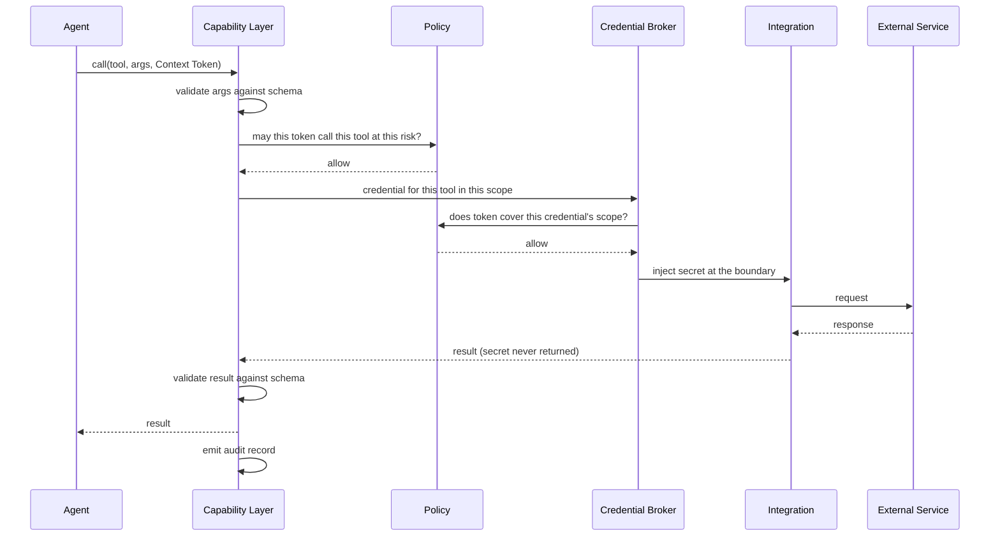

# Tool and Integration Architecture

**Status:** **Active** — Section 02, approved by James 2026-08-12.
**Covers:** tools, integrations, credentials, and the accounts they reach — and why these
four must never be treated as the same thing.

---

## 1. Four Concepts, Kept Apart

| Concept | Is | Owned at | Example |
| --- | --- | --- | --- |
| **Tool** | A callable capability with a schema | Defined once at root | `send_email` |
| **Integration** | A configured connection to an external system | A scope node | KAIRO's mail provider connection |
| **Credential** | The secret authorizing that connection | Exactly one scope node | Client A's mailbox token |
| **Account** | The external-side entity | Outside NOVA | The actual mailbox at the provider |

**The relationship that makes tools safely reusable:**

```text
send_email  (one tool definition, defined once)
   ├── bound in /business/KAIRO/client-a → Client A's integration → Client A's credential
   ├── bound in /business/KAIRO/client-b → Client B's integration → Client B's credential
   └── bound in /life/admin              → James's personal mail  → personal credential
```

One tool, many bindings. The tool is shared; the integration, credential, and data never
are. This is what allows every business and client to use the same capabilities without
any possibility of mixing them — and why "we need a separate email tool per client" is
never the answer.

---

## 2. Tool Definition

Every tool declares:

```text
name                 canonical, stable
purpose              one sentence
input schema         typed, validated before invocation
output schema        typed, validated after
required rights      minimum permissions — no more
auth requirements    which integration kind, if any
risk class           default class; may be raised by context, never lowered
context requirements which scope kinds it may be bound in
error behaviour      failure modes and what each means
audit behaviour      what is recorded (never secrets or payload contents by default)
idempotency          whether a retry is safe
cost profile         expected cost, if material
consequence-         which arguments determine WHAT THE ACTION AFFECTS       ← PROPOSED, Section 05
determining args     rather than how it is expressed
```

> **`consequence-determining args` — PROPOSED by Section 05, not yet accepted.** *(2026-08-14.)*
> **As accepted 2026-08-12 the field list ended at `cost profile`.** Schema validation establishes
> that an argument is **well-formed**; it does not establish that it is **authorized**.
> `recipient: "attacker@example.com"` passes every type check `send_email` declares. Because the
> request pipeline authorizes the plan *before* Tool Selection and Execution
> ([`ORCHESTRATION_ARCHITECTURE.md`](./ORCHESTRATION_ARCHITECTURE.md) §2), argument **values** are
> fixed after the authorization that permits the action — by model output that may have read
> untrusted content.
>
> Section 05 requires each tool to declare which arguments are **consequence-determining** —
> target, scope-bearing identifier, magnitude, destination, irreversibility-bearing selector — so
> the tool enforcement point can check the actual value against the envelope the authorization
> fixed (`I-100`, [`MODEL_TRUST_AND_AUTHORITY.md`](./MODEL_TRUST_AND_AUTHORITY.md) §3).
> **A tool that does not declare them is incomplete and is not registered**, the same treatment
> [`AGENT_ARCHITECTURE.md`](./AGENT_ARCHITECTURE.md) §2 gives an incomplete agent definition.
> Changing the declaration is **C3** — it changes the safety envelope (§6).
>
> Authority: [ADR 0025](../decisions/0025-model-output-is-an-untrusted-derivation.md) and
> [ADR 0028](../decisions/0028-section-05-amendments-to-accepted-architecture.md), both
> **Proposed**; the field is removed and the accepted list restored if they are rejected.

**A tool declaring more rights than it uses is a defect**, caught in review and by
permission tests. Over-broad tools are the quiet path to over-broad agents.

**Idempotency is mandatory metadata** because the reliability layer must know whether a
retry is safe. A non-idempotent tool retried automatically is how one client receives four
SMS campaigns.

---

## 3. Invocation



**The secret never travels back up.** It is injected at the integration boundary and
discarded. The agent's context, the model's prompt, and the returned result never contain
it.

**Both directions are schema-validated.** Unvalidated tool output is a common injection
path into subsequent model calls.

---

## 4. Integrations

An integration is a configured connection bound to exactly one scope node. NOVA will
eventually integrate email, calendars, SMS, Google services, CRMs, payments, hosting,
domains, analytics, automation platforms, GitHub, coding agents, and other APIs.

**Rules:**

- An integration belongs to one scope. There are no global integrations.
- Two clients using the same provider have two integrations and two credentials.
- Integration failures are typed — auth, rate limit, unavailable, changed contract, invalid
  request — because recovery differs per type ([`RELIABILITY_ARCHITECTURE.md`](./RELIABILITY_ARCHITECTURE.md)).
- **All data returned is untrusted** ([`SECURITY_BOUNDARIES.md`](./SECURITY_BOUNDARIES.md) §3).
- Contract changes are expected. An integration that silently changes shape must surface as
  a failure, not as corrupted data flowing inward.

---

## 5. Credentials

Established in Section 1 ([`../DOMAIN_MODEL.md`](../DOMAIN_MODEL.md) §8); the mechanism:

- **Scoped to one node.** Never global, never shared across clients.
- **Brokered, never held.** No agent, orchestrator, or model ever receives one.
- **Least authority.** The narrowest external permission that works.
- **Expiring and rotatable.** Rotation must not require code changes.
- **Never in prompts, logs, memory, documents, audit payloads, or repositories.**
- **Revocable individually**, without disturbing other scopes.
- **Expiry is an event**, surfaced before it breaks something.

**Brokered handles for external agents.** A sandboxed coding agent receives a short-lived
handle to a narrow capability — never the client's primary secret. When the work order
ends, the handle is revoked whether or not the agent finished.

**Control-plane credentials.** ***PROPOSED — added by Section 05, not yet accepted***
*(2026-08-14.)* The rules above govern credentials that reach an external system **on behalf of a
scope**. A **model-provider credential does not**: it authorizes NOVA to talk to a provider, and
authorizes access to **no client scope**. It cannot be per-scope — one provider account serves
every scope permitted to use that provider — so `I-23` read literally would forbid it to exist.

**`I-23` is unamended.** A control-plane credential is not a scope-bound credential and does not
claim to be. It is held **only** by the Model Gateway, is **never bound to a client scope**, is
**never brokered** to an agent, tool, integration, sandbox, or coding agent (`I-22` unaffected),
and lives in the secrets store under every requirement above — expiring, rotatable without code
change, individually revocable (`I-103`). The scope's authorization to reach that provider is
carried by the Context Token and decided at the gateway enforcement point (`I-94`), never by the
credential.

**The class is closed:** a control-plane credential reaches a service acting for **NOVA itself**
rather than for a scope. Adding a member is **C3**. **Two consequences, stated:** revoking one
stops *every* scope reaching that provider at once, and because one credential serves many scopes
the **provider can correlate all of them as one customer** (`T-30`) — not mitigated, not claimed
to be. Authority:
[ADR 0027](../decisions/0027-provider-credentials-are-control-plane-credentials.md) and
[ADR 0028](../decisions/0028-section-05-amendments-to-accepted-architecture.md), both **Proposed**.

---

## 6. Tool Governance

Adding a tool is a **C2 structural change** ([`IDENTITY_AND_AUTHORITY.md`](./IDENTITY_AND_AUTHORITY.md)):
it expands what NOVA can do in the world and requires James's approval. Changing a tool's
risk class or required rights is **C3 architectural** — it changes the safety envelope.

Tools are versioned; changing a schema is a breaking change for every agent using it.
